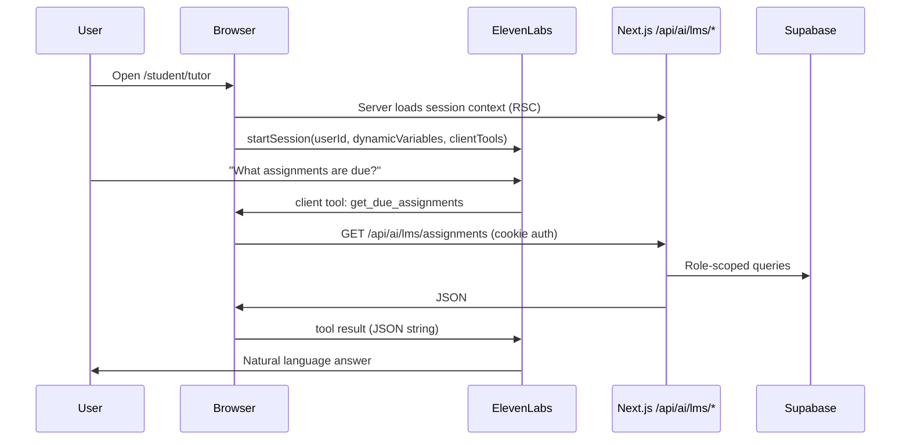

# ElevenLabs LMS Agent Setup (Aalgo AI)

This guide configures the **LMS Aalgo AI agent** used at `/student/tutor`, `/parent/tutor`, and `/teacher/tutor`. It is separate from the marketing voice assistant (`NEXT_PUBLIC_ELEVENLABS_AGENT_ID`).

## Prerequisites

1. **Environment variable** in `.env.local` (and production):

   ```env
   NEXT_PUBLIC_ELEVENLABS_STUDENT_AGENT_ID=agent_xxxxxxxx
   ```

2. **Logged-in user** on a tutor page (student, parent, or teacher). The app sends:
   - `userId` — Supabase user id
   - `dynamicVariables` — name, role, academic year, key counts (see below)
   - **Client tools** — browser calls your Next.js API with the user’s session cookie

3. **Restart** the dev server after changing env vars.

---

## Architecture (how data flows)



**Important:** Tools are **client tools** (run in the browser), but they only call **your** authenticated API routes — not public data.

---

## Step 1 — Open the correct agent

1. Go to [ElevenLabs Conversational AI](https://elevenlabs.io/app/conversational-ai).
2. Open the agent whose ID matches `NEXT_PUBLIC_ELEVENLABS_STUDENT_AGENT_ID`.
3. Do **not** add LMS tools to the marketing voice agent.

---

## Step 2 — Add dynamic variables

In the agent **Variables** section, create these (types as noted). The app sends them on every session:

| Variable | Type | Sent when |
|----------|------|-----------|
| `user_name` | string | Always |
| `user_role` | string | `student`, `parent`, `teacher`, or `admin` |
| `academic_year` | string | Always (e.g. `2025–2026`) |
| `open_assignments` | number | Student |
| `attendance_percent` | number | Student |
| `streak_days` | number | Student |
| `unread_messages` | number | Student |
| `average_grade_percent` | number | Student (if graded work exists) |
| `linked_children_count` | number | Parent |
| `assigned_courses` | number | Teacher / admin |
| `pending_grading` | number | Teacher / admin |

Use them in the system prompt, e.g.:

```text
You are Aalgo AI, the in-LMS assistant for Aalgorix World Academy.

The user is {{user_name}} (role: {{user_role}}, academic year {{academic_year}}).

For students: they have {{open_assignments}} open assignments, {{attendance_percent}}% learning activity this month, and a {{streak_days}}-day streak.

For parents: they have {{linked_children_count}} linked child(ren). Use tools for per-child details.

For teachers: they teach {{assigned_courses}} course(s) with {{pending_grading}} submissions awaiting grading.

Always call the appropriate tool before answering questions about assignments, attendance, schedule, or grades. Do not invent LMS data.
```

---

## Step 3 — Register client tools

In ElevenLabs, add **Client tools** with these **exact names** (must match `aalgo-ai-workspace.tsx`):

### 1. `get_lms_summary`

- **Description:** Overview for the logged-in user (profile, progress, open work, streaks, or children/grading queue).
- **Parameters:** none
- **Returns:** JSON string from `GET /api/ai/lms/summary`

### 2. `get_due_assignments`

- **Description:** Open, overdue, or needs-revision assignments (student); per-child lists (parent); pending grading + deadlines (teacher).
- **Parameters:** none
- **Returns:** JSON from `GET /api/ai/lms/assignments`

### 3. `get_attendance_summary`

- **Description:** Learning-activity attendance % (not a separate attendance table). Students and linked children for parents.
- **Parameters:** none
- **Returns:** JSON from `GET /api/ai/lms/attendance`

### 4. `get_upcoming_schedule`

- **Description:** Today’s schedule, upcoming live classes (student), per-child today (parent), or teacher calendar events.
- **Parameters:** none
- **Returns:** JSON from `GET /api/ai/lms/schedule`

### 5. `get_recent_grades`

- **Description:** Recent graded work (student), per-child grades (parent), or recently graded submissions (teacher).
- **Parameters:** none
- **Returns:** JSON from `GET /api/ai/lms/grades`

- **Tool type:** Client tool (executed in the user’s browser).
- **Response timeout:** In each tool’s settings, set **Wait for response** ON and increase **Response timeout** to **10000 ms** (10 seconds) if available — slow first requests can otherwise time out.

---

## Step 4 — Agent behavior rules

Add to the system prompt:

1. **Call tools first** for factual LMS questions (assignments, attendance, schedule, grades).
2. **Explain attendance** as “learning activity” (lessons + submissions on weekdays), not physical school attendance.
3. **Parents:** If multiple children are linked, say which child you’re reporting when data is per-child.
4. **Teachers:** Distinguish “assignments to grade” from “assignment deadlines for students.”
5. **Study help:** General tutoring is fine without tools; portal facts require tools.
6. **Privacy:** Only discuss data returned by tools for the logged-in user.

---

## Step 5 — Test locally

1. `npm run dev`
2. Log in as a **student** → `/student/tutor`
3. Wait for “Online · ready to chat”
4. Ask: *“What assignments do I have due?”*
5. In DevTools **Network**, confirm:
   - `GET /api/ai/lms/assignments` → `200`
   - Response includes real assignment titles from your database

Repeat as **parent** (`/parent/tutor`) and **teacher** (`/teacher/tutor`).

### Troubleshooting

| Symptom | Fix |
|---------|-----|
| “Aalgo AI is not configured” | Set `NEXT_PUBLIC_ELEVENLABS_STUDENT_AGENT_ID` and restart dev server |
| Tool never fires | Tool names must match exactly; agent prompt must instruct tool use |
| API returns 401 | User not logged in; open tutor from dashboard while signed in |
| API returns 403 | Wrong role for route (should not happen on correct `/tutor` page) |
| Empty assignments | Student has no enrollments or all work submitted |
| Agent hallucinates data | Strengthen prompt: “Never guess; always call tools for LMS facts” |
| Tool timed out | Increase client tool **Response timeout** to 10s in ElevenLabs; refresh `/student/tutor` and try again (attendance now returns instantly for students) |

---

## Code reference

| Piece | Path |
|-------|------|
| Chat UI + client tools | `src/components/aalgo-ai/aalgo-ai-workspace.tsx` |
| Session + dynamic variables | `src/lib/ai/lms-context.ts`, `src/lib/ai/load-tutor-session.ts` |
| API auth | `src/lib/ai/require-lms-api-session.ts` |
| API routes | `src/app/api/ai/lms/{summary,assignments,attendance,schedule,grades}/route.ts` |

---

## Production checklist

- [ ] `NEXT_PUBLIC_ELEVENLABS_STUDENT_AGENT_ID` set in hosting env
- [ ] LMS agent has 5 client tools + variables configured
- [ ] Marketing agent **does not** include LMS tools
- [ ] Smoke-test all three roles on production URL
- [ ] (Optional) Enable ElevenLabs content moderation / guardrails in agent settings
