# Aalgorix World Academy — Enterprise LMS Architecture & Implementation Plan

> **Document Type:** Solution Architecture · Database Design · API Specification · Roadmap  
> **Audience:** Architect · CTO · Senior Engineers · Product · DevOps  
> **Last Updated:** June 18, 2026  
> **Status:** Design specification (extends deployed foundation schema)  
> **Related:** [`ARCHITECTURE.md`](./ARCHITECTURE.md) · [`MASTER_DOCUMENTATION.md`](./MASTER_DOCUMENTATION.md) · [`PROJECT_STATUS.md`](./PROJECT_STATUS.md)

---

## Table of Contents

1. [Executive Summary](#1-executive-summary)
2. [Complete System Architecture](#2-complete-system-architecture)
3. [Academic Structure](#3-academic-structure)
4. [Batch Management](#4-batch-management)
5. [Teacher Management & RBAC](#5-teacher-management--rbac)
6. [Course Management](#6-course-management)
7. [Teacher Assignment Logic](#7-teacher-assignment-logic)
8. [Student Access Logic](#8-student-access-logic)
9. [Live Class Management](#9-live-class-management)
10. [Assessment Management](#10-assessment-management)
11. [Parent Portal](#11-parent-portal)
12. [Permission Matrix](#12-permission-matrix)
13. [Multi-Tenant Architecture](#13-multi-tenant-architecture)
14. [Database Design & ERD](#14-database-design--erd)
15. [API Design](#15-api-design)
16. [AI Features](#16-ai-features)
17. [Scalability & Infrastructure](#17-scalability--infrastructure)
18. [Folder Structure](#18-folder-structure)
19. [Tech Stack](#19-tech-stack)
20. [Development Roadmap](#20-development-roadmap)
21. [Deployment Architecture](#21-deployment-architecture)
22. [Security Best Practices](#22-security-best-practices)
23. [User Journey Diagrams](#23-user-journey-diagrams)
24. [Future Expansion Strategy](#24-future-expansion-strategy)
25. [Mapping to Current Codebase](#25-mapping-to-current-codebase)

---

## 1. Executive Summary

This document defines the **enterprise-grade architecture** for an online schooling platform serving **Grades 3–12** under **Cambridge** and **NIOS** curricula. It extends the existing Aalgorix World Academy stack:

| Layer | Current choice |
|-------|----------------|
| Frontend | Next.js 16 App Router, React 19, Tailwind CSS v4 |
| Backend | Server Components, Server Actions, API Route Handlers |
| Database | PostgreSQL (Supabase) with Row-Level Security |
| Auth | Supabase Auth (email/password + Google OAuth) |
| Storage | Supabase Storage with TUS resumable video uploads |
| Edge | Vercel deployment + `src/proxy.ts` RBAC gate |

**Target scale:** 1,000 students · 100 teachers · 5,000+ lessons · 30 students max per batch.

**Core design principles:**

- **Defense in depth** — Edge RBAC + application guards + PostgreSQL RLS
- **Tenant isolation** — `school_id` + `academic_session_id` on operational tables
- **Subject-scoped teachers** — One teacher teaches exactly one subject
- **Batch as scheduling unit** — Live classes, attendance, roster scoped to batch
- **Course as content unit** — One course = Board × Class × Subject

---

## 2. Complete System Architecture

### 2.1 High-Level Architecture

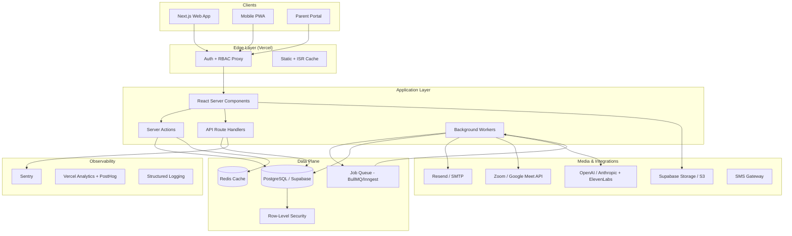

### 2.2 Service Decomposition (Evolution Path)

At 1,000 students / 100 teachers, a **modular monolith** is sufficient. Split services only when a domain hits independent scaling needs.

| Phase | Architecture | Domains |
|-------|-------------|---------|
| **Now (MVP)** | Next.js monolith + Supabase | Auth, LMS, Admin |
| **Phase 2** | + Inngest/BullMQ workers | Notifications, batch jobs, AI generation |
| **Phase 3** | Extract media service | Video transcoding, recording pipeline |
| **Phase 4** | Extract assessment service | Quiz engine, auto-grading at scale |

---

## 3. Academic Structure

### 3.1 Hierarchy

```
School (tenant)
 └── Academic Session (e.g. 2025–26)
      └── Board (Cambridge | NIOS)
           └── Grade (3–12)
                └── Subject (varies by board + grade)
                     └── Course (content container)
                          └── Chapter → Topic → Lesson
                               ├── Videos, PDFs
                               ├── Assignments, Quizzes
                               └── Live Class Sessions
```

### 3.2 Boards

| Board | Code | Notes |
|-------|------|-------|
| Cambridge | `cambridge` | IGCSE / Lower Secondary pathways |
| NIOS | `nios` | Open schooling, flexible subject combinations |

### 3.3 Classes (Grades)

Grades 3 through 12. Each grade has a subject matrix that differs by board — stored in `curriculum_subjects`, not hardcoded.

### 3.4 Subject Matrix

```sql
-- Example: Cambridge Grade 10 offers Math, Physics, Chemistry, English, etc.
curriculum_subjects (board_id, grade_id, subject_id, is_mandatory, credit_hours)
```

NIOS and Cambridge differ per grade. The matrix is admin-configurable per school and academic session.

---

## 4. Batch Management

### 4.1 Requirements

- Maximum **30 students per batch**
- Automatic division when enrollment exceeds capacity
- Manual override and transfer support
- Capacity tracking with waitlist option

### 4.2 Batch Creation Logic

**Trigger:** Enrollment count for `(session_id, board_id, grade_id)` crosses threshold, or admin clicks **Generate Batches**.

**Algorithm:**

```
INPUT:  enrolled_students[], max_capacity = 30
OUTPUT: batches[]

1. Sort students by enrollment_date ASC (FIFO)
   OR balanced by gender/region (configurable strategy)
2. batch_count = CEIL(student_count / max_capacity)
3. FOR i = 1..batch_count:
     batch_name = chr(64 + i)  → A, B, C, D
     capacity = min(30, remaining_students)
4. Distribute students round-robin OR fill-sequentially (admin setting)
5. Last batch may be < 30 (e.g. Batch D = 10)
```

**Example — Class 8, 100 enrolled students:**

| Batch | Students | Capacity Used |
|-------|----------|---------------|
| 8-A | 30 | 100% |
| 8-B | 30 | 100% |
| 8-C | 30 | 100% |
| 8-D | 10 | 33% |

### 4.3 Automatic Student Allocation

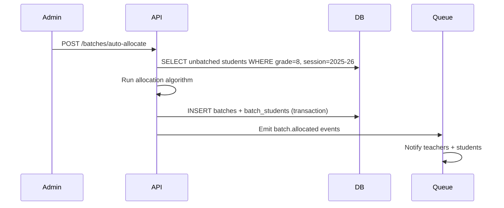

**Rules:**

- A student belongs to **exactly one batch per grade per session**
- Batch assignment is independent of subject enrollment (same batch for all subjects in that grade)
- Re-allocation preserves attendance history (soft transfer)

### 4.4 Manual Allocation

Admin UI: drag-and-drop student list between batches.

```http
POST /api/v1/batches/{batchId}/students
Content-Type: application/json

{
  "student_ids": ["uuid1", "uuid2"],
  "mode": "move"
}
```

**Validations:**

- Target batch `current_count + incoming ≤ max_capacity` (unless `force: true` with admin override)
- Student must be enrolled in same `(session, board, grade)`

### 4.5 Batch Transfer Process

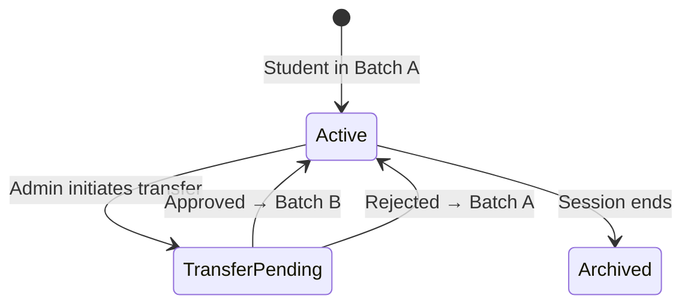

**Steps:**

1. Create `batch_transfers` record (`from_batch`, `to_batch`, `reason`, `status`)
2. On approval: update `batch_students` (end `left_at` on old row, insert new row)
3. Reassign future live class registrations to new batch timetable
4. **Do not** delete historical attendance tied to old batch
5. Notify teachers of both batches

### 4.6 Capacity Management

| Field | Purpose |
|-------|---------|
| `max_capacity` | Default 30, overridable per batch |
| `current_count` | Denormalized counter (maintained by trigger) |
| `waitlist_enabled` | When all batches full, queue new enrollments |
| `min_viable_batch` | Alert if batch < 15 students (operational KPI) |

**DB constraint:**

```sql
CHECK (current_count <= max_capacity)
-- Enforced at application layer for transfers; trigger for inserts
```

---

## 5. Teacher Management & RBAC

### 5.1 Core Rule: One Teacher → One Subject

A teacher profile has a **primary subject** (`teacher_profiles.primary_subject_id`). They may teach that subject across multiple grades and batches, but **never a second subject**.

### 5.2 Teacher Access Control

| Allowed | Denied |
|---------|--------|
| View assigned classes, batches, students | Access other subjects |
| View assigned subject content | Edit other teachers' content |
| Conduct classes for assigned subject | View confidential admin data |
| Upload assignments for assigned subject | |
| Create quizzes for assigned subject | |
| Evaluate assigned subject work only | |

### 5.3 RBAC Architecture (3 Layers)

```mermaid
flowchart LR
    ROLE[Role: student|parent|teacher|admin]
    PERM[Permissions: resource.action]
    SCOPE[Scope: board|grade|batch|subject|course]

    ROLE --> PERM
    PERM --> SCOPE
    SCOPE --> RLS[PostgreSQL RLS Policies]
    SCOPE --> EDGE[Edge Proxy Path Guard]
```

### 5.4 Roles

| Role | Scope |
|------|-------|
| **Super Admin** | Full tenant; confidential data |
| **Academic Admin** | Curriculum, batches, teacher assignment |
| **Teacher** | Assigned subject + class + batch only |
| **Student** | Own enrollment scope |
| **Parent** | Linked children only |
| **Content Reviewer** | Approve/publish content (optional) |

### 5.5 RLS Helper Functions (Extend Existing)

New security-definer helpers to add alongside existing `is_admin()`, `is_teacher()`, `parent_has_student()`:

```sql
teacher_teaches_subject(p_subject_id uuid) → boolean
teacher_teaches_batch(p_batch_id uuid) → boolean
student_in_batch(p_batch_id uuid) → boolean
user_in_academic_session(p_session_id uuid) → boolean
```

**Teacher content policy pattern:**

```sql
USING (
  is_admin()
  OR (
    is_teacher()
    AND EXISTS (
      SELECT 1 FROM teacher_subject_assignments tsa
      JOIN courses c ON c.subject_id = tsa.subject_id
        AND c.grade_id = tsa.grade_id
        AND c.board_id = tsa.board_id
      WHERE tsa.teacher_id = auth.uid()
        AND c.id = assignments.course_id
    )
  )
)
```

---

## 6. Course Management

### 6.1 Hierarchy

```
Board → Class → Subject → Chapters → Topics → Lessons
                                              ├── Videos
                                              ├── PDFs
                                              ├── Assignments
                                              ├── Quizzes
                                              └── Live Classes
```

### 6.2 Course Creation Workflow

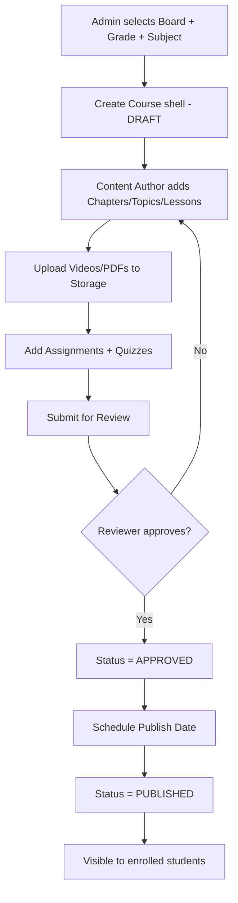

### 6.3 Content Approval Workflow

| Status | Who can edit | Visible to students |
|--------|-------------|---------------------|
| `draft` | Author, Admin | No |
| `in_review` | Reviewer comments only | No |
| `approved` | Admin (minor fixes) | No |
| `published` | Admin (hotfix with version bump) | Yes |
| `archived` | Admin restore only | No |

### 6.4 Version Control

```
course_versions
  course_id, version_number, snapshot_jsonb, published_at, published_by
```

- On publish: snapshot entire tree (chapters → lessons → assets metadata)
- Students mid-enrollment stay on `enrollment.course_version_id` unless admin migrates
- Diff view for curriculum changes between versions

### 6.5 Publishing Workflow

1. Validate: all mandatory lessons have video OR PDF
2. Validate: at least one assessment per module (configurable)
3. Set `is_published = true`, `published_at = now()`
4. Invalidate CDN/cache keys for course slug
5. Queue notification to enrolled students (if mid-session update)

### 6.6 Archiving Workflow

- Set `status = archived`, `archived_at`, `archived_by`
- Enrollments remain readable (historical grades)
- No new enrollments
- Live classes cancelled via cascade job

---

## 7. Teacher Assignment Logic

### 7.1 Example Assignments

**Class 10:**

| Subject | Teacher |
|---------|---------|
| Mathematics | Teacher A |
| Science | Teacher B |
| English | Teacher C |

**Class 11:**

| Subject | Teacher |
|---------|---------|
| Mathematics | Teacher A |
| Physics | Teacher D |

### 7.2 Database Relationships

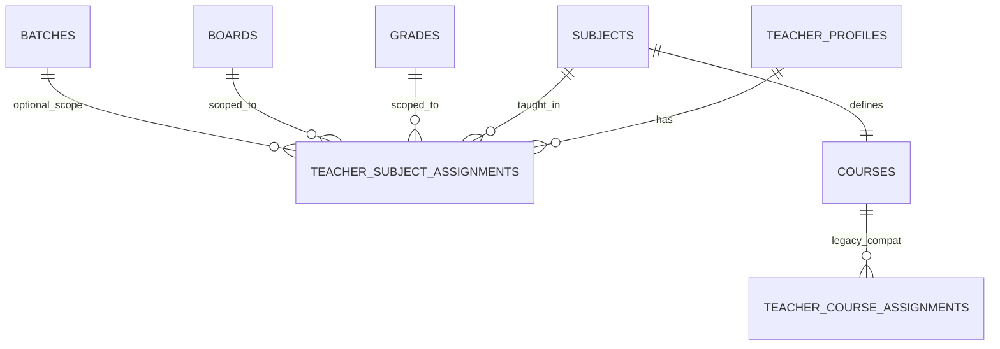

### 7.3 Assignment Workflow

1. Admin creates teacher profile with `primary_subject_id`
2. Admin assigns: Board + Grade (+ optional Batch) + Session
3. System auto-links to `courses` matching `(board, grade, subject, session)`
4. Teacher dashboard queries `teacher_subject_assignments` → resolves courses, batches, students
5. **Constraint:** `UNIQUE (teacher_id, subject_id, board_id, grade_id, session_id, batch_id)`

---

## 8. Student Access Logic

### 8.1 Authorization Scope

A student session resolves to:

```typescript
type StudentScope = {
  school_id: string;
  academic_session_id: string;
  board_id: string;
  grade_id: string;
  batch_id: string;
  enrollment_ids: string[];
  course_ids: string[];  // from subject enrollments
};
```

### 8.2 Authorization Rules

| Data | Filter |
|------|--------|
| Board/Class | `student_profiles.board_id`, `grade_id` |
| Batch | `batch_students WHERE student_id = me AND left_at IS NULL` |
| Subjects | `enrollments WHERE student_id = me AND status = active` |
| Lessons | enrolled course + `content_unlocks` + `lesson_is_unlocked_for_student()` |
| Assignments | enrolled courses only |
| Attendance | `attendance WHERE student_id = me` |
| Timetable | `timetable_slots WHERE batch_id = my_batch` |
| Results | `exam_results WHERE student_id = me` |

**Deny by default:** If scope cannot be resolved, return 403 (not empty list).

### 8.3 What Students See

- Their board, class, batch
- Enrolled subjects only
- Their assignments, attendance, timetable, exam results
- Live classes for their batch
- AI tutor scoped to enrolled curriculum

---

## 9. Live Class Management

### 9.1 Integration Architecture

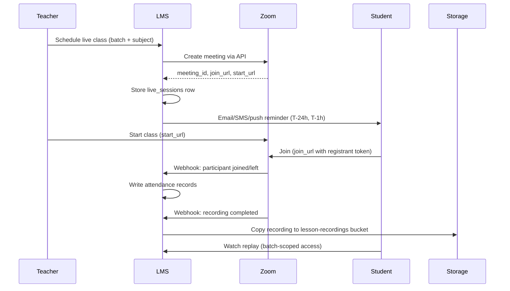

### 9.2 Components

| Component | Design |
|-----------|--------|
| **Zoom/Google Meet** | OAuth app; create meeting on schedule; webhooks for join/leave/recording |
| **Attendance** | Auto-mark from join duration (e.g. 70% = present); teacher override |
| **Recording storage** | Copy to `lesson-recordings` bucket; signed URLs |
| **Replay access** | RLS: student in batch at session time or currently in batch |
| **Scheduling** | Teacher creates session for batch + course; conflict detection |
| **Reminders** | Queue jobs at T-24h and T-1h via Inngest |

### 9.3 Data Model

```sql
live_sessions (
  id, course_id, batch_id, teacher_id,
  scheduled_at, duration_minutes,
  provider,  -- 'zoom' | 'google_meet'
  external_meeting_id, join_url, host_url,
  recording_storage_path, status,
  attendance_auto_mark_threshold_percent
)
```

---

## 10. Assessment Management

### 10.1 Assessment Types

| Type | Grading | Storage |
|------|---------|---------|
| **Assignment** | Manual | File upload → `submissions` (existing) |
| **MCQ Test** | Automated | `quiz_attempts` + `quiz_answers` |
| **Descriptive Test** | Manual + AI assist | Rich text / file |
| **Practice Worksheet** | Self-check / AI | Unlimited attempts |
| **AI-generated Paper** | Mixed | `assessment_blueprints` → generated questions |
| **Formal Exam** | Manual + moderation | `exams` + `exam_results` |

### 10.2 Automated Grading Pipeline

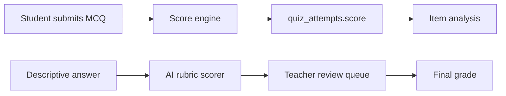

### 10.3 Question Bank Schema

```
question_banks → questions (mcq|descriptive|numeric)
              → question_options (for MCQ)
              → question_tags (topic, difficulty, bloom_level)
quizzes → quiz_questions (ordered, points)
quiz_attempts → quiz_answers
```

---

## 11. Parent Portal

### 11.1 Capabilities

| Feature | Data source |
|---------|-------------|
| View attendance | `attendance` + `live_sessions` |
| View performance | `exam_results`, `submissions`, `quiz_attempts` |
| View assignments | `assignments` + `submissions.status` |
| View fee status | `fee_invoices` + `payments` |
| Communicate with teachers | `messages` thread per child + subject |

### 11.2 Workflow

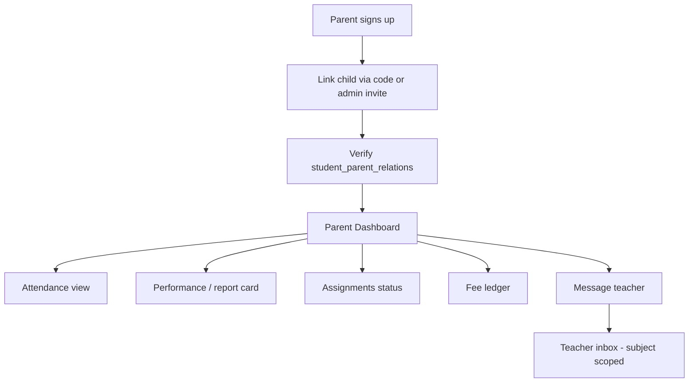

### 11.3 Multi-Child Support

- Child selector in header
- All queries parameterized by `selected_student_id`
- RLS enforces `parent_has_student(selected_student_id)`

---

## 12. Permission Matrix

| Resource / Action | Super Admin | Academic Admin | Teacher (scoped) | Student | Parent |
|-------------------|:---:|:---:|:---:|:---:|:---:|
| Users – create | ✅ | ✅ | ❌ | ❌ | ❌ |
| Users – view all | ✅ | ✅ | ❌ | ❌ | ❌ |
| Boards/Grades – manage | ✅ | ✅ | ❌ | ❌ | ❌ |
| Batches – create/allocate | ✅ | ✅ | ❌ | ❌ | ❌ |
| Batches – view | ✅ | ✅ | ✅ assigned | ✅ own | ✅ child |
| Courses – create | ✅ | ✅ | ❌ | ❌ | ❌ |
| Courses – edit content | ✅ | ✅ | ✅ own subject | ❌ | ❌ |
| Courses – view | ✅ | ✅ | ✅ assigned | ✅ enrolled | ✅ child enrolled |
| Lessons – upload | ✅ | ✅ | ✅ assigned subject | ❌ | ❌ |
| Assignments – create | ✅ | ✅ | ✅ assigned subject | ❌ | ❌ |
| Assignments – submit | ❌ | ❌ | ❌ | ✅ own | ❌ |
| Submissions – grade | ✅ | ✅ | ✅ assigned subject | ❌ | ❌ |
| Quizzes – create | ✅ | ✅ | ✅ assigned subject | ❌ | ❌ |
| Quizzes – attempt | ❌ | ❌ | ❌ | ✅ assigned | ❌ |
| Live classes – schedule | ✅ | ✅ | ✅ assigned | ❌ | ❌ |
| Live classes – join | ✅ | ✅ | ✅ host | ✅ batch | ❌ |
| Attendance – mark | ✅ | ✅ | ✅ own sessions | ❌ | ❌ |
| Attendance – view | ✅ | ✅ | ✅ own batches | ✅ own | ✅ child |
| Results/Exams – manage | ✅ | ✅ | ✅ assigned | ❌ | ❌ |
| Results – view | ✅ | ✅ | ✅ assigned | ✅ own | ✅ child |
| Fees – view | ✅ | ✅ | ❌ | ❌ | ✅ own |
| Messages – send to teacher | ✅ | ✅ | ✅ | ❌ | ✅ |
| Admin analytics | ✅ | ✅ | ❌ | ❌ | ❌ |
| AI Tutor – use | ✅ | ✅ | ✅ | ✅ | ❌ |
| Other teachers' content | ✅ | ✅ | ❌ | ❌ | ❌ |

---

## 13. Multi-Tenant Architecture

### 13.1 Tenant Model

```
schools (tenant root)
  id, name, slug, domain, settings_jsonb, subscription_plan
academic_sessions
  id, school_id, name, start_date, end_date, is_current
```

Every operational row carries:

- `school_id` (tenant isolation)
- `academic_session_id` (temporal isolation)

### 13.2 Tenant Isolation

| Layer | Mechanism |
|-------|-----------|
| **Database** | RLS: `school_id = current_school_id()` from JWT claim or profile |
| **Storage** | Path prefix: `{school_id}/{session_id}/...` |
| **Cache** | Key prefix: `school:{id}:...` |
| **Search** | Filtered indices per school |

### 13.3 Data Security

- Encryption at rest (Supabase default)
- TLS everywhere
- PII minimization in logs
- Audit log: `audit_events (actor_id, action, resource, ip, timestamp)`
- GDPR: export + delete workflows per student

### 13.4 Scaling Strategy

| Component | Strategy |
|-----------|----------|
| **App** | Vercel auto-scale; ISR for marketing |
| **DB** | Supabase Pro → read replicas for reporting |
| **Cache** | Redis: session scope, course catalog, timetable |
| **Files** | CDN for videos; TUS resumable uploads |
| **Queue** | Inngest for reminders, batch jobs, AI tasks |
| **Search** | Postgres full-text → Meilisearch if needed later |

---

## 14. Database Design & ERD

### 14.1 Entity Relationship Diagram

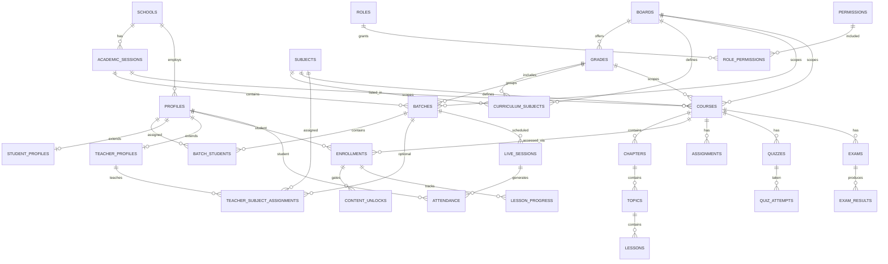

### 14.2 Table Inventory

| Table | PK | Key FKs | Purpose |
|-------|-----|---------|---------|
| `schools` | `id` | — | Tenant root |
| `academic_sessions` | `id` | `school_id` | Temporal scope (2025–26) |
| `boards` | `id` | `school_id` | Cambridge, NIOS |
| `grades` | `id` | `school_id` | Grade 3–12 |
| `subjects` | `id` | `school_id` | Math, Physics, etc. |
| `curriculum_subjects` | `id` | `board_id`, `grade_id`, `subject_id` | Board×grade subject matrix |
| `profiles` | `id` | `auth.users` | User identity (existing) |
| `student_profiles` | `profile_id` | `board_id`, `grade_id`, `session_id` | Student academic context |
| `teacher_profiles` | `profile_id` | `primary_subject_id` | One subject per teacher |
| `roles` | `id` | `school_id` | RBAC roles |
| `permissions` | `id` | — | `resource.action` pairs |
| `role_permissions` | composite | `role_id`, `permission_id` | Role grants |
| `batches` | `id` | `session_id`, `board_id`, `grade_id` | Class sections (max 30) |
| `batch_students` | `id` | `batch_id`, `student_id` | Student batch membership |
| `batch_transfers` | `id` | `from_batch_id`, `to_batch_id` | Transfer audit trail |
| `courses` | `id` | `board_id`, `grade_id`, `subject_id` | Content container (extends existing) |
| `chapters` | `id` | `course_id` | Course structure |
| `topics` | `id` | `chapter_id` | Sub-unit |
| `lessons` | `id` | `module_id` / `topic_id` | Video, PDF, live (extends existing) |
| `teacher_subject_assignments` | `id` | `teacher_id`, `subject_id`, `grade_id` | Subject-scoped teaching |
| `teacher_course_assignments` | composite | `teacher_id`, `course_id` | Legacy compat (existing) |
| `enrollments` | `id` | `student_id`, `course_id` | Student access (existing) |
| `assignments` | `id` | `course_id` | Homework (existing) |
| `submissions` | `id` | `assignment_id`, `student_id` | Student work (existing) |
| `quizzes` | `id` | `course_id` | MCQ/descriptive tests |
| `quiz_attempts` | `id` | `quiz_id`, `student_id` | Attempt records |
| `exams` | `id` | `course_id`, `batch_id` | Formal assessments |
| `exam_results` | `id` | `exam_id`, `student_id` | Published marks |
| `live_sessions` | `id` | `batch_id`, `course_id`, `teacher_id` | Scheduled live classes |
| `attendance` | `id` | `student_id`, `session_id` | Present/absent/late |
| `course_versions` | `id` | `course_id` | Publish snapshots |
| `audit_events` | `id` | `actor_id` | Immutable admin audit log |

### 14.3 Core DDL (New Tables)

#### Identity & RBAC

```sql
CREATE TABLE schools (
  id UUID PRIMARY KEY DEFAULT gen_random_uuid(),
  name TEXT NOT NULL,
  slug TEXT UNIQUE NOT NULL,
  domain TEXT,
  settings JSONB DEFAULT '{}',
  created_at TIMESTAMPTZ DEFAULT now()
);

CREATE TABLE roles (
  id UUID PRIMARY KEY DEFAULT gen_random_uuid(),
  school_id UUID REFERENCES schools(id),
  name TEXT NOT NULL,
  is_system BOOLEAN DEFAULT false
);

CREATE TABLE permissions (
  id UUID PRIMARY KEY DEFAULT gen_random_uuid(),
  resource TEXT NOT NULL,
  action TEXT NOT NULL,
  UNIQUE(resource, action)
);

CREATE TABLE role_permissions (
  role_id UUID REFERENCES roles(id),
  permission_id UUID REFERENCES permissions(id),
  PRIMARY KEY (role_id, permission_id)
);

CREATE TABLE student_profiles (
  profile_id UUID PRIMARY KEY REFERENCES profiles(id),
  school_id UUID REFERENCES schools(id),
  board_id UUID REFERENCES boards(id),
  grade_id UUID REFERENCES grades(id),
  academic_session_id UUID REFERENCES academic_sessions(id),
  admission_number TEXT UNIQUE
);

CREATE TABLE teacher_profiles (
  profile_id UUID PRIMARY KEY REFERENCES profiles(id),
  school_id UUID REFERENCES schools(id),
  primary_subject_id UUID REFERENCES subjects(id) NOT NULL,
  employee_id TEXT
);
```

#### Academic Catalog

```sql
CREATE TABLE boards (
  id UUID PRIMARY KEY DEFAULT gen_random_uuid(),
  school_id UUID REFERENCES schools(id),
  code TEXT NOT NULL,
  name TEXT NOT NULL,
  UNIQUE(school_id, code)
);

CREATE TABLE grades (
  id UUID PRIMARY KEY DEFAULT gen_random_uuid(),
  school_id UUID REFERENCES schools(id),
  level INT NOT NULL CHECK (level BETWEEN 3 AND 12),
  name TEXT NOT NULL,
  UNIQUE(school_id, level)
);

CREATE TABLE subjects (
  id UUID PRIMARY KEY DEFAULT gen_random_uuid(),
  school_id UUID REFERENCES schools(id),
  code TEXT NOT NULL,
  name TEXT NOT NULL
);

CREATE TABLE academic_sessions (
  id UUID PRIMARY KEY DEFAULT gen_random_uuid(),
  school_id UUID REFERENCES schools(id),
  name TEXT NOT NULL,
  start_date DATE NOT NULL,
  end_date DATE NOT NULL,
  is_current BOOLEAN DEFAULT false
);

CREATE TABLE curriculum_subjects (
  id UUID PRIMARY KEY DEFAULT gen_random_uuid(),
  board_id UUID REFERENCES boards(id),
  grade_id UUID REFERENCES grades(id),
  subject_id UUID REFERENCES subjects(id),
  is_mandatory BOOLEAN DEFAULT true,
  credit_hours INT,
  UNIQUE(board_id, grade_id, subject_id)
);
```

#### Batches

```sql
CREATE TABLE batches (
  id UUID PRIMARY KEY DEFAULT gen_random_uuid(),
  school_id UUID REFERENCES schools(id),
  academic_session_id UUID REFERENCES academic_sessions(id),
  board_id UUID REFERENCES boards(id),
  grade_id UUID REFERENCES grades(id),
  name TEXT NOT NULL,
  max_capacity INT DEFAULT 30,
  current_count INT DEFAULT 0,
  status TEXT DEFAULT 'active',
  created_at TIMESTAMPTZ DEFAULT now(),
  UNIQUE(academic_session_id, board_id, grade_id, name),
  CHECK (current_count <= max_capacity)
);

CREATE TABLE batch_students (
  id UUID PRIMARY KEY DEFAULT gen_random_uuid(),
  batch_id UUID REFERENCES batches(id),
  student_id UUID REFERENCES profiles(id),
  joined_at TIMESTAMPTZ DEFAULT now(),
  left_at TIMESTAMPTZ
);

CREATE TABLE batch_transfers (
  id UUID PRIMARY KEY DEFAULT gen_random_uuid(),
  student_id UUID REFERENCES profiles(id),
  from_batch_id UUID REFERENCES batches(id),
  to_batch_id UUID REFERENCES batches(id),
  reason TEXT,
  status TEXT DEFAULT 'pending',
  requested_by UUID REFERENCES profiles(id),
  approved_by UUID REFERENCES profiles(id),
  created_at TIMESTAMPTZ DEFAULT now()
);
```

#### Teacher Assignments

```sql
CREATE TABLE teacher_subject_assignments (
  id UUID PRIMARY KEY DEFAULT gen_random_uuid(),
  teacher_id UUID REFERENCES profiles(id),
  subject_id UUID REFERENCES subjects(id),
  board_id UUID REFERENCES boards(id),
  grade_id UUID REFERENCES grades(id),
  academic_session_id UUID REFERENCES academic_sessions(id),
  batch_id UUID REFERENCES batches(id),
  assigned_at TIMESTAMPTZ DEFAULT now()
);
```

#### Attendance & Live Classes

```sql
CREATE TABLE live_sessions (
  id UUID PRIMARY KEY DEFAULT gen_random_uuid(),
  school_id UUID REFERENCES schools(id),
  course_id UUID REFERENCES courses(id),
  batch_id UUID REFERENCES batches(id),
  teacher_id UUID REFERENCES profiles(id),
  scheduled_at TIMESTAMPTZ NOT NULL,
  duration_minutes INT DEFAULT 60,
  provider TEXT CHECK (provider IN ('zoom', 'google_meet')),
  external_meeting_id TEXT,
  join_url TEXT,
  host_url TEXT,
  recording_path TEXT,
  status TEXT DEFAULT 'scheduled'
);

CREATE TABLE attendance (
  id UUID PRIMARY KEY DEFAULT gen_random_uuid(),
  student_id UUID REFERENCES profiles(id),
  session_id UUID,
  session_type TEXT CHECK (session_type IN ('live', 'in_person')),
  batch_id UUID REFERENCES batches(id),
  status TEXT CHECK (status IN ('present', 'absent', 'late', 'excused')),
  marked_at TIMESTAMPTZ,
  marked_by UUID REFERENCES profiles(id),
  duration_minutes INT,
  UNIQUE(student_id, session_id, session_type)
);
```

#### Assessments & Results

```sql
CREATE TABLE quizzes (
  id UUID PRIMARY KEY DEFAULT gen_random_uuid(),
  course_id UUID REFERENCES courses(id),
  title TEXT NOT NULL,
  time_limit_minutes INT,
  max_attempts INT DEFAULT 1,
  is_published BOOLEAN DEFAULT false,
  created_by UUID REFERENCES profiles(id)
);

CREATE TABLE quiz_attempts (
  id UUID PRIMARY KEY DEFAULT gen_random_uuid(),
  quiz_id UUID REFERENCES quizzes(id),
  student_id UUID REFERENCES profiles(id),
  score DECIMAL(5,2),
  max_score DECIMAL(5,2),
  started_at TIMESTAMPTZ,
  submitted_at TIMESTAMPTZ,
  auto_graded BOOLEAN DEFAULT true
);

CREATE TABLE exams (
  id UUID PRIMARY KEY DEFAULT gen_random_uuid(),
  course_id UUID REFERENCES courses(id),
  batch_id UUID REFERENCES batches(id),
  title TEXT NOT NULL,
  exam_date DATE,
  max_marks INT,
  weight_percent DECIMAL(5,2)
);

CREATE TABLE exam_results (
  id UUID PRIMARY KEY DEFAULT gen_random_uuid(),
  exam_id UUID REFERENCES exams(id),
  student_id UUID REFERENCES profiles(id),
  marks_obtained DECIMAL(6,2),
  grade TEXT,
  remarks TEXT,
  published_at TIMESTAMPTZ,
  UNIQUE(exam_id, student_id)
);
```

### 14.4 Planned Migrations

| Migration file | Scope |
|----------------|-------|
| `20250521000000_foundation.sql` | Deployed — profiles, courses, enrollments, RLS |
| `20250619000000_academic_structure.sql` | schools, boards, grades, subjects, sessions |
| `20250619000001_batches.sql` | batches, batch_students, transfers, allocation triggers |
| `20250619000002_assessments_live.sql` | quizzes, exams, live_sessions, attendance |

---

## 15. API Design

**Base URL:** `https://api.aalgorix.academy/v1` (or Next.js `/api/v1/*`)  
**Auth:** Supabase JWT in `Authorization: Bearer <token>`

### 15.1 Authentication

```http
POST /auth/login
Content-Type: application/json

{
  "email": "student@example.com",
  "password": "***"
}
```

```json
{
  "access_token": "eyJ...",
  "refresh_token": "...",
  "user": {
    "id": "uuid",
    "role": "student",
    "scope": {
      "school_id": "uuid",
      "board_id": "uuid",
      "grade_id": "uuid",
      "batch_id": "uuid",
      "session_id": "uuid"
    }
  }
}
```

### 15.2 Batch Management

```http
POST /batches/auto-allocate
Authorization: Bearer <admin_token>
Content-Type: application/json

{
  "academic_session_id": "uuid",
  "board_id": "uuid",
  "grade_id": "uuid",
  "max_capacity": 30,
  "strategy": "fifo"
}
```

```json
{
  "batches": [
    { "id": "uuid", "name": "8-A", "student_count": 30 },
    { "id": "uuid", "name": "8-B", "student_count": 30 },
    { "id": "uuid", "name": "8-C", "student_count": 30 },
    { "id": "uuid", "name": "8-D", "student_count": 10 }
  ],
  "total_students": 100
}
```

```http
POST /batches/{batchId}/transfer
Content-Type: application/json

{
  "student_id": "uuid",
  "to_batch_id": "uuid",
  "reason": "Schedule conflict"
}
```

### 15.3 Course Management

```http
POST /courses
Content-Type: application/json

{
  "board_id": "uuid",
  "grade_id": "uuid",
  "subject_id": "uuid",
  "academic_session_id": "uuid",
  "title": "Cambridge Grade 10 Mathematics",
  "unlock_strategy": "sequential"
}
```

```http
POST /courses/{courseId}/publish
```

### 15.4 Teacher Management

```http
POST /teachers/{teacherId}/assignments
Content-Type: application/json

{
  "subject_id": "uuid-math",
  "board_id": "uuid-cambridge",
  "grade_ids": ["uuid-g10", "uuid-g11"],
  "academic_session_id": "uuid",
  "batch_id": null
}
```

### 15.5 Student Management

```http
POST /students/{studentId}/enroll
Content-Type: application/json

{
  "subject_ids": ["math", "physics", "english"],
  "academic_session_id": "uuid"
}
```

Response triggers batch auto-allocation if student has no batch.

### 15.6 Attendance

```http
GET /attendance?student_id=uuid&from=2025-06-01&to=2025-06-30
```

```json
{
  "summary": {
    "present": 18,
    "absent": 2,
    "late": 1,
    "percentage": 85.7
  },
  "records": [
    {
      "date": "2025-06-02",
      "subject": "Mathematics",
      "status": "present",
      "session_type": "live"
    }
  ]
}
```

### 15.7 Assessments

```http
POST /quizzes/{quizId}/attempts
Content-Type: application/json

{
  "answers": [
    { "question_id": "uuid", "selected_option_id": "uuid" }
  ]
}
```

```json
{
  "attempt_id": "uuid",
  "score": 85,
  "max_score": 100,
  "auto_graded": true,
  "question_feedback": [
    { "question_id": "uuid", "correct": true }
  ]
}
```

### 15.8 Reporting

```http
GET /reports/batch/{batchId}/performance?subject_id=uuid
```

```json
{
  "batch_name": "10-A",
  "subject": "Mathematics",
  "avg_score": 72.4,
  "students_below_threshold": 5,
  "top_performers": ["..."]
}
```

---

## 16. AI Features

| Feature | Implementation | Integration point |
|---------|---------------|-------------------|
| **AI Tutor** | RAG over course content + student progress context | Extend ElevenLabs + in-dashboard chat; pgvector on lesson transcripts |
| **Personalized Learning Path** | Rules engine + analytics: weak topics → recommend lessons | `learning_recommendations` table; nightly job |
| **AI Doubt Solving** | LLM with guardrails; cite lesson sources only | `/api/ai/doubt` with course scope filter |
| **AI Test Generator** | Blueprint → LLM generates questions → teacher review queue | `assessment_blueprints` → `questions` (status: draft) |
| **AI Performance Analytics** | Aggregate submissions + quiz data → narrative insights | Parent + teacher dashboards |
| **AI Attendance Insights** | Pattern detection: chronic absenteeism, day-of-week trends | Alert academic admin |
| **Parent AI Reports** | Weekly LLM summary: attendance + grades + assignments | Email job; store in `parent_reports` |

**Guardrails:** All AI calls scoped by `student_scope` / `teacher_scope`; no cross-student data leakage; human review for generated assessments before publish.

---

## 17. Scalability & Infrastructure

### 17.1 Expected Scale

| Resource | Count |
|----------|-------|
| Students | 1,000 |
| Teachers | 100 |
| Lessons | 5,000+ |
| Batches | ~40 (avg 25 students across grades) |

### 17.2 Component Strategy

| Component | Design |
|-----------|--------|
| **Microservices** | Modular monolith now; extract media + assessment at 10K+ students |
| **Database** | PostgreSQL primary + read replica for reporting |
| **Caching** | Upstash Redis — course catalog, timetables, session scope |
| **Queue** | Inngest — batch allocation, reminders, AI jobs, email digests |
| **File storage** | Supabase Storage + CDN; TUS for uploads |
| **Monitoring** | Sentry (errors) + PostHog (product) + structured logs |
| **Security** | RLS + edge RBAC + signed URLs + rate limiting |

---

## 18. Folder Structure

Extended layout building on existing `src/` tree:

```
src/
├── app/
│   ├── (dashboard)/
│   │   ├── admin/
│   │   │   ├── academic/          # boards, grades, subjects, sessions
│   │   │   ├── batches/           # allocation, transfers
│   │   │   ├── staffing/          # teacher assignments (exists)
│   │   │   ├── courses/           # exists
│   │   │   ├── enrollments/
│   │   │   └── reports/
│   │   ├── teacher/
│   │   │   ├── batches/
│   │   │   ├── live-classes/
│   │   │   ├── quizzes/
│   │   │   └── attendance/
│   │   ├── student/
│   │   │   ├── timetable/
│   │   │   ├── live-classes/
│   │   │   └── exams/
│   │   └── parent/
│   │       ├── fees/
│   │       └── messages/
│   └── api/v1/
│       ├── batches/
│       ├── attendance/
│       ├── live-sessions/
│       ├── quizzes/
│       ├── ai/
│       └── webhooks/zoom/
├── lib/
│   ├── domain/
│   │   ├── batches/allocate.ts
│   │   ├── rbac/permissions.ts
│   │   └── assessments/grader.ts
│   ├── integrations/
│   │   ├── zoom/
│   │   └── google-meet/
│   └── ai/
│       ├── tutor.ts
│       ├── test-generator.ts
│       └── rag.ts
├── jobs/                          # Inngest functions
│   ├── batch-allocate.ts
│   ├── send-reminders.ts
│   └── ai-weekly-parent-report.ts
└── supabase/migrations/
    ├── 20250521000000_foundation.sql
    ├── 20250619000000_academic_structure.sql
    ├── 20250619000001_batches.sql
    └── 20250619000002_assessments_live.sql
```

---

## 19. Tech Stack

| Layer | Choice | Rationale |
|-------|--------|-----------|
| Frontend | Next.js 16, React 19, Tailwind v4 | Deployed |
| Auth | Supabase Auth | Deployed |
| Database | PostgreSQL + RLS | Enterprise isolation |
| ORM/Queries | Supabase client + typed helpers | Matches current pattern |
| File storage | Supabase Storage + TUS | Resumable video uploads |
| Cache | Upstash Redis | Serverless-friendly |
| Queue | Inngest | Vercel-native, retries, cron |
| Live classes | Zoom API + Google Meet fallback | Webhook attendance |
| AI | OpenAI/Anthropic + pgvector + ElevenLabs | Tutor voice started |
| Email | Resend | Transactional + digests |
| Monitoring | Sentry + PostHog | Errors + product analytics |
| CI/CD | GitHub Actions → Vercel | PR previews |

---

## 20. Development Roadmap

### Phase 1 — Academic Foundation (4–6 weeks)

- [ ] Migration: `schools`, `boards`, `grades`, `subjects`, `academic_sessions`
- [ ] Extend `courses` with board/grade/subject FKs
- [ ] `student_profiles`, `teacher_profiles` with subject constraint
- [ ] Admin UI: academic catalog CRUD
- [ ] Replace mock student data with real queries

### Phase 2 — Batches & Enrollment (3–4 weeks)

- [ ] `batches`, `batch_students`, allocation algorithm
- [ ] Admin enrollment UI + auto-batch
- [ ] Batch transfer workflow
- [ ] Timetable model

### Phase 3 — Teacher Scoping (2–3 weeks)

- [ ] `teacher_subject_assignments` + tighten RLS
- [ ] Teacher dashboard filtered by scope
- [ ] Content ownership rules (edit own subject only)

### Phase 4 — Assessments (4–5 weeks)

- [ ] Quiz engine (MCQ auto-grade)
- [ ] Descriptive + manual grading
- [ ] Exams + results publish workflow
- [ ] AI test generator (review queue)

### Phase 5 — Live Classes (3–4 weeks)

- [ ] Zoom integration + webhooks
- [ ] Attendance consolidation
- [ ] Recording storage + replay
- [ ] Reminder jobs

### Phase 6 — Parent Portal & Fees (3 weeks)

- [ ] Fee invoices + payment status
- [ ] Parent messaging
- [ ] AI weekly reports

### Phase 7 — Production Hardening (4 weeks)

- [ ] Test suite (auth, RLS, batch allocation)
- [ ] CI/CD pipeline
- [ ] Sentry + monitoring
- [ ] Load test (1K concurrent)

---

## 21. Deployment Architecture

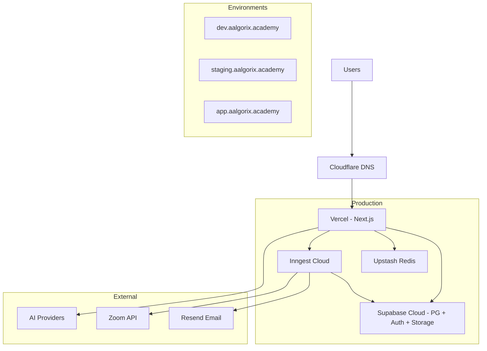

| Environment | Purpose |
|-------------|---------|
| **Dev** | Supabase branch DB, Vercel preview |
| **Staging** | Full integration testing with Zoom sandbox |
| **Prod** | RLS enforced, secrets in Vercel env, daily DB backups |

---

## 22. Security Best Practices

1. **Never trust the client** — all authorization in RLS + server actions
2. **JWT custom claims** — `school_id`, `role` synced via trigger
3. **Service role** — only in webhooks/background jobs, never client
4. **Signed URLs** — all video/recording access time-limited
5. **Rate limiting** — API routes via Upstash ratelimit
6. **Input validation** — Zod schemas on every mutation
7. **Audit trail** — admin actions logged immutably
8. **COPPA/privacy** — parent consent for under-13; data retention policy
9. **Content Security Policy** — strict CSP headers on dashboard
10. **Penetration test** — before public enrollment at scale

---

## 23. User Journey Diagrams

### 23.1 Student Journey

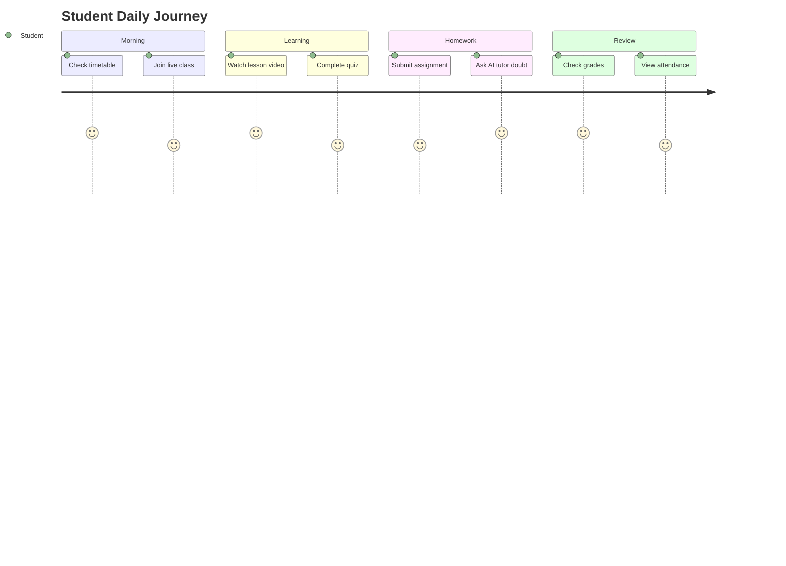

### 23.2 Teacher Journey

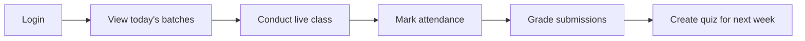

### 23.3 Admin Enrollment Journey

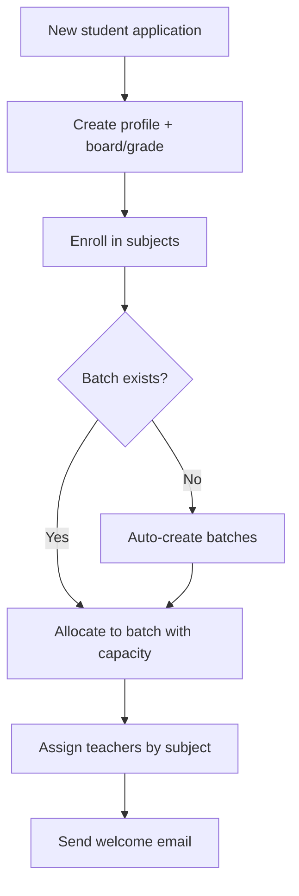

---

## 24. Future Expansion Strategy

| Horizon | Capability |
|---------|-----------|
| **6 months** | Multi-school white-label, mobile PWA offline lessons |
| **12 months** | Proctored exams, blockchain certificates, regional language packs |
| **18 months** | Marketplace for third-party Cambridge content providers |
| **24 months** | Adaptive learning engine, predictive dropout alerts, franchise ops dashboard |
| **Scale 10K+** | Read replicas, dedicated assessment microservice, multi-region CDN |

---

## 25. Mapping to Current Codebase

The deployed foundation implements approximately **40%** of this architecture.

| Exists today | This design adds |
|--------------|------------------|
| `profiles` + 4 roles | `schools`, fine-grained permissions, subject-scoped teachers |
| `courses → modules → lessons` | `chapters → topics`, board/grade/subject FKs, versioning |
| `teacher_course_assignments` | `teacher_subject_assignments` with batch scope |
| `enrollments` + unlock engine | Batch-aware enrollment + timetable |
| `assignments` + `submissions` | Quizzes, exams, AI grading |
| Edge proxy RBAC | Extended scope checks per batch/subject |
| TUS video uploads | Live recordings + replay pipeline |
| AI tutor (marketing) | In-LMS RAG tutor with curriculum scope |

**Recommended first implementation step:** `20250619000000_academic_structure.sql` adding `schools`, `boards`, `grades`, `subjects`, `academic_sessions`, `batches`, and FK columns on `courses` — then wire admin UI before building live classes.

---

*This document is the enterprise architecture specification for Cambridge/NIOS Grades 3–12. It complements [`ARCHITECTURE.md`](./ARCHITECTURE.md) (initial build plan) and [`MASTER_DOCUMENTATION.md`](./MASTER_DOCUMENTATION.md) (current codebase audit).*
