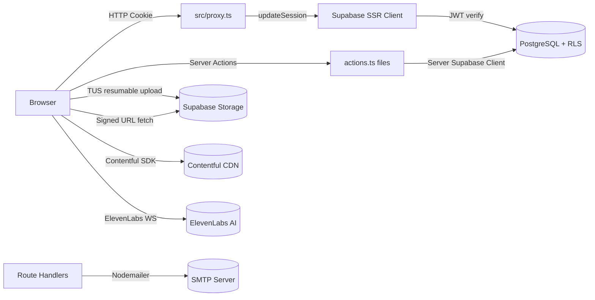
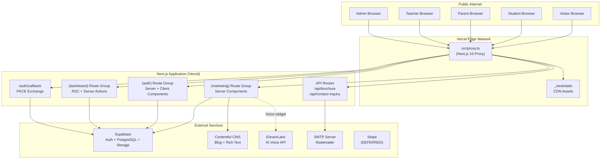
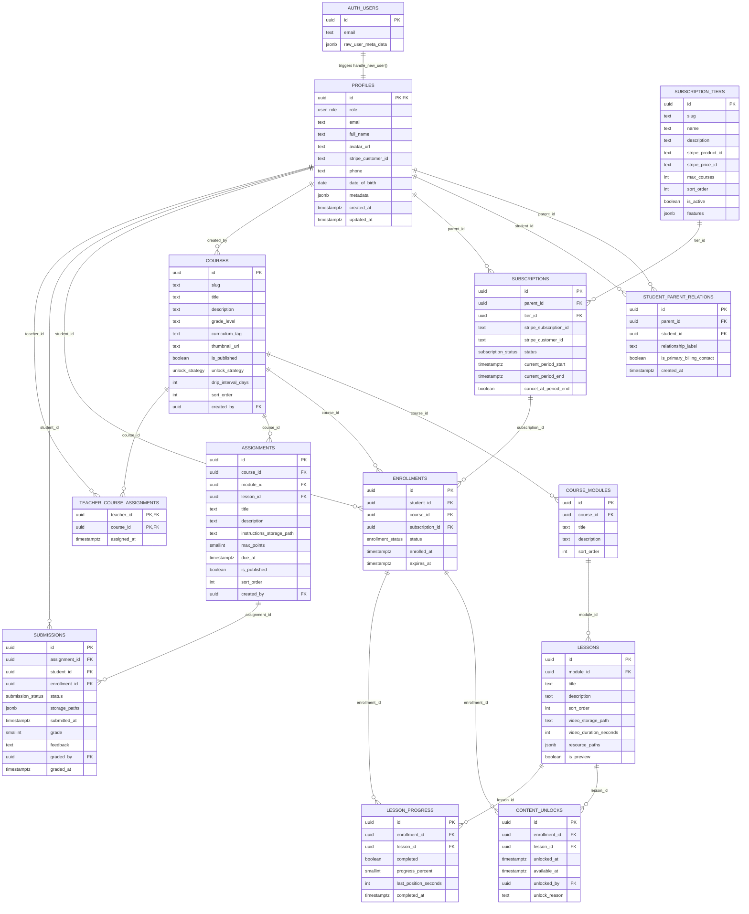
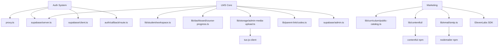
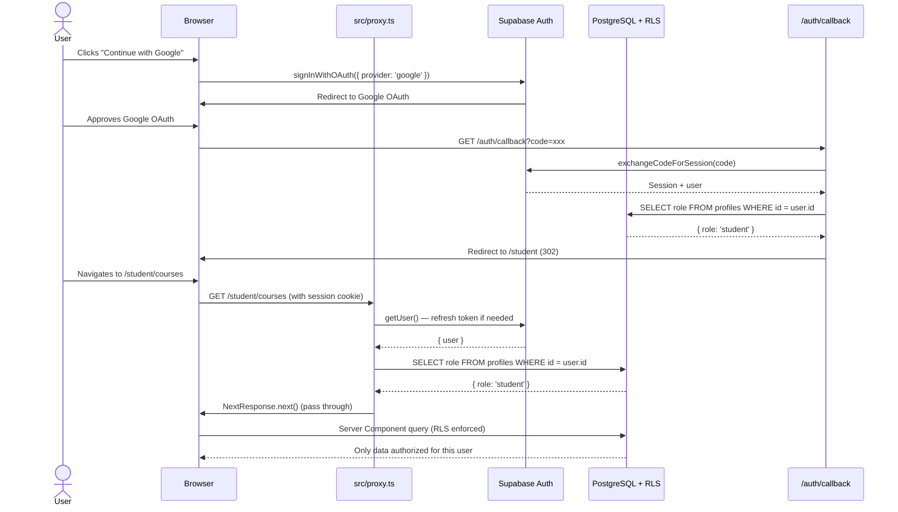
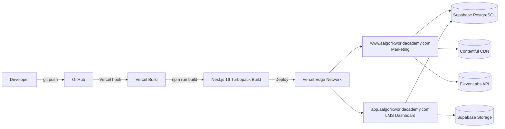

# Aalgorix World Academy — Enterprise-Grade Master Documentation

> **Document Type:** CTO Audit · Architecture Review · Product Analysis · Knowledge Transfer Guide  
> **Generated:** June 17, 2026  
> **Codebase Revision:** Phase 0–3+ (Phases 0–1b complete + significant Phase 3–7 work implemented)  
> **Audience:** Developer · Architect · CTO · Investor · PM · QA · DevOps · Designer · Stakeholder  

---

## Table of Contents

1. [Executive Dashboard](#1-executive-dashboard)
2. [Project Completion Analysis](#2-project-completion-analysis)
3. [Executive Summary](#3-executive-summary)
4. [Business Logic Mapping](#4-business-logic-mapping)
5. [Complete System Understanding](#5-complete-system-understanding)
6. [Project Structure Analysis](#6-project-structure-analysis)
7. [Critical File Analysis](#7-critical-file-analysis)
8. [Architecture Review](#8-architecture-review)
9. [Feature Inventory & Gap Analysis](#9-feature-inventory--gap-analysis)
10. [User Journey Analysis](#10-user-journey-analysis)
11. [Database Documentation](#11-database-documentation)
12. [API Documentation](#12-api-documentation)
13. [Frontend Documentation](#13-frontend-documentation)
14. [Backend Documentation](#14-backend-documentation)
15. [AI Readiness Audit](#15-ai-readiness-audit)
16. [Dependency Impact Analysis](#16-dependency-impact-analysis)
17. [Authentication & Security Review](#17-authentication--security-review)
18. [Performance & Scalability Analysis](#18-performance--scalability-analysis)
19. [DevOps & Deployment Review](#19-devops--deployment-review)
20. [Testing Analysis](#20-testing-analysis)
21. [Technical Debt Report](#21-technical-debt-report)
22. [Missing Feature Analysis](#22-missing-feature-analysis)
23. [Infrastructure & Cost Analysis](#23-infrastructure--cost-analysis)
24. [Prioritized Product Roadmap](#24-prioritized-product-roadmap)
25. [Knowledge Transfer Guide](#25-knowledge-transfer-guide)
26. [Maintenance Guide](#26-maintenance-guide)
27. [Future Improvement Recommendations](#27-future-improvement-recommendations)
28. [CTO Final Review](#28-cto-final-review)

---

## 1. Executive Dashboard

### 1.1 Scorecard

| Metric | Value |
|--------|-------|
| **Project Name** | Aalgorix World Academy |
| **Current Stage** | Beta (advancing toward Production) |
| **Overall Completion %** | ~62% |
| **Code Quality Score** | 8.0 / 10 |
| **Architecture Score** | 8.5 / 10 |
| **Security Score** | 8.0 / 10 |
| **Scalability Score** | 7.5 / 10 |
| **Maintainability Score** | 8.0 / 10 |
| **Technical Debt Score** | 7.0 / 10 (lower = more debt) |
| **Testing Coverage Score** | 1.0 / 10 |

### 1.2 Top 5 Strengths

1. **Enterprise-grade database security**: Row-Level Security enforced across all 13 PostgreSQL tables with security-definer SQL helpers — cross-tenant isolation is handled at the data plane, not just the application layer.
2. **Modern technology choices**: Next.js 16 App Router with React 19, React Compiler (zero-manual-memoization), Tailwind CSS v4, TypeScript strict mode — a genuinely forward-looking stack.
3. **Multi-actor RBAC at the edge**: The proxy gate (`src/proxy.ts`) enforces role-prefix alignment on every request before route handlers execute, making horizontal privilege movement structurally impossible.
4. **Resumable video uploads**: TUS-protocol resumable uploads for lesson videos (up to 500 MB) via Supabase Storage with retry logic — production-grade media delivery from day one.
5. **Flexible content unlock engine**: Four unlock strategies (`all_at_once`, `sequential`, `drip`, `manual`) implemented at both the database and application layer, giving curriculum designers granular control over pacing.

### 1.3 Top 5 Risks

1. **Zero test coverage**: No unit, integration, or E2E tests exist anywhere in the repository. Any regression is invisible until it reaches production.
2. **`parent_link_codes` table missing from migration**: The parent-student linking flow references a `parent_link_codes` table that does not appear in the deployed foundation SQL migration — this entire feature will fail in a fresh Supabase project.
3. **Hardcoded mock data in student dashboard**: `streakDays`, `goalDone/Total`, `attendance rate (96%)`, and `motivation` strings are hardcoded in `student/page.tsx`. They create a trust deficit with real users.
4. **No CI/CD pipeline**: No GitHub Actions, Vercel CI configuration, or deployment automation exists. Manual deploys are error-prone at scale.
5. **Stripe integration completely absent**: The billing system is deferred to "finale" but the subscription model is the primary revenue mechanism. Until it exists, the platform has no monetization path.

### 1.4 Top 5 Opportunities

1. **AI Tutor integration**: The ElevenLabs AI Voice Assistant is already live on the marketing page. Connecting the same capability inside the student dashboard LMS workspace is a high-value, low-effort win.
2. **Contentful CMS pipeline**: The Contentful blog integration is fully functional — expanding it to drive marketing copy, course descriptions, and curriculum pathways replaces static hardcoding with a live editorial workflow.
3. **Progressive Web App (PWA)**: The platform's architecture (RSC + client islands) is ideal for PWA conversion, enabling offline lesson access for students in low-connectivity regions.
4. **Analytics layer**: No analytics instrumentation exists. A lightweight integration (Posthog or Vercel Analytics) would immediately provide user journey data for product decisions.
5. **shadcn/ui design system**: Planned but not yet initialized. Once initialized, it will dramatically accelerate UI development across all four actor dashboards and reduce inconsistency in bespoke Tailwind primitives.

### 1.5 Top 5 Immediate Priorities

1. Add the `parent_link_codes` migration to Supabase to fix the broken parent-student linking flow.
2. Write at minimum smoke tests for the auth callback, proxy routing, and lesson progress actions.
3. Replace all hardcoded mock data in the student dashboard with real database queries.
4. Set up a basic GitHub Actions CI pipeline that runs `npm run build` and `eslint` on every PR.
5. Wire the Stripe webhook foundation and `subscriptions` activation flow so monetization can proceed.

---

## 2. Project Completion Analysis

### 2.1 Overall Completion

```
Overall Completion: 62%

[████████████░░░░░░░░] 62%
```

### 2.2 Project Maturity Level

> **Current: Beta**  
> The public marketing gateway is production-quality. The LMS core (courses, lessons, grading, parent monitoring) is functionally implemented but has hardcoded data, missing tests, and no billing gate. The platform is demonstrable to investors and early adopters, but not ready for paid public enrollment.

### 2.3 Completion Matrix

| Module | Completion % | Status | Priority | Notes |
|--------|-------------|--------|----------|-------|
| **Marketing Site** | 95% | ✅ Live | — | Minor: dynamic CMS wiring for pathways pending |
| **Authentication** | 92% | ✅ Complete | — | Email/Password + Google OAuth + recovery all working |
| **Authorization (RBAC)** | 90% | ✅ Solid | — | Edge proxy + RLS; minor: admin provisioning flow manual |
| **Database Schema** | 85% | ✅ Deployed | HIGH | Missing: `parent_link_codes` table in migration |
| **Student LMS Workspace** | 75% | 🔶 Partial | HIGH | Course player works; streak/attendance are mock data |
| **Admin Course Management** | 80% | 🔶 Partial | HIGH | CRUD works; no drag-reorder, no bulk publish |
| **Admin Staffing** | 75% | 🔶 Partial | MEDIUM | Teacher assignment works; no user provisioning UI |
| **Teacher Grading** | 80% | 🔶 Partial | HIGH | Grade/return works; no grade history view |
| **Parent Dashboard** | 75% | 🔶 Partial | MEDIUM | Progress + report card work; link code flow needs migration fix |
| **AI Voice Assistant** | 90% | ✅ Marketing | MEDIUM | Marketing page live; not yet inside LMS |
| **Blog / CMS** | 85% | ✅ Functional | LOW | Contentful integration complete; graceful degradation when unconfigured |
| **Payments / Billing** | 5% | ❌ Not started | CRITICAL | Schema exists; zero application code |
| **Testing** | 0% | ❌ None | CRITICAL | No test files found anywhere |
| **CI/CD Pipeline** | 5% | ❌ Minimal | HIGH | Only `vercel.json` redirect rule exists |
| **Monitoring / Logging** | 2% | ❌ None | HIGH | No error tracking, no APM |
| **Email System** | 85% | ✅ Functional | LOW | Brochure + contact inquiry SMTP working |

### 2.4 Remaining Work

- **Critical**: Add `parent_link_codes` migration, Stripe integration, test suite, monitoring
- **High**: Replace mock data, complete CI/CD, admin user management UI, PWA/offline support
- **Medium**: shadcn/ui design system, live classes, quiz engine, certificates, multi-child selector

### 2.5 Effort Estimates

| Milestone | Estimated Time |
|-----------|----------------|
| **Fix Critical Blockers** (missing migration, mock data) | 1–2 days |
| **MVP** (billing gate + tests + CI) | 4–6 weeks |
| **Production Ready** (monitoring, load tests, PWA) | 8–12 weeks |
| **Enterprise Scale** (multi-tenant, white-label, analytics) | 6–9 months |

---

## 3. Executive Summary

### 3.1 Project Vision

To be the premier digital learning institution for ambitious students globally, delivering accredited curriculum through a premium, technology-driven platform that rivals the best online schools in the world.

### 3.2 Mission

Democratize access to world-class, accredited education through an LMS that connects students, parents, teachers, and administrators in a secure, transparent, and engaging learning environment.

### 3.3 Problem Statement

Traditional schooling and generic EdTech platforms fail to simultaneously serve all four parties in the education value chain:

- **Students** need engaging, paced curriculum with immediate feedback.
- **Parents** need visibility into their children's progress and grades without access to teaching tools.
- **Teachers** need a structured grading workflow scoped to their assigned courses.
- **Admins** need full platform control without compromising any actor's access boundary.

### 3.4 Solution Overview

Aalgorix World Academy is a role-scoped modular LMS where each actor class sees a purpose-built interface enforced at the data plane (PostgreSQL RLS) and the network edge (Next.js proxy). Content flows from Admin → Teacher → Student, with Parents as transparent observers. The billing model (Stripe, deferred) gates enrollment so the curriculum is self-sustaining.

### 3.5 Business Objectives

1. Convert marketing visitors to enrolled students through a premium acquisition funnel.
2. Retain students through high-quality curriculum delivery and AI-assisted tutoring.
3. Build trust with parents through transparent progress dashboards.
4. Monetize through subscription tiers (Stripe) and eventually institutional licensing.

### 3.6 Target Audience

- **Students**: Ages 10–18, home-schooled or supplementary learners, globally distributed.
- **Parents/Guardians**: Primary billing contacts seeking oversight and accountability.
- **Teachers**: Subject-matter experts delivering and grading curriculum.
- **Admins**: Platform operators managing the full catalog and user base.

### 3.7 Unique Value Proposition

A single platform that unifies curriculum delivery, teacher grading, parent monitoring, and AI tutoring — all enforced by database-level security, not just application logic.

---

## 4. Business Logic Mapping

### 4.1 Feature → Business Goal Table

| Feature | Business Problem Solved | User Pain Solved | Revenue Impact | Retention Impact | Dependencies |
|---------|------------------------|------------------|---------------|-----------------|--------------|
| **Multi-role Auth** | Prevents unauthorized access to any actor surface | Users don't accidentally see wrong dashboards | Foundational | High | Supabase Auth, DB trigger |
| **Course Unlock Strategies** | Drives paced, structured learning completion | Students don't get overwhelmed | Increases completion rates → referrals | Very High | `content_unlocks`, `lesson_progress` |
| **Parent-Student Linking** | Creates accountability loop | Parents can't see child's progress without it | Increases parental buy-in → subscriptions | High | `parent_link_codes`, service-role client |
| **Teacher Grading Station** | Enables feedback lifecycle | Teachers grade without manual coordination | Reduces churn from poor feedback experience | Very High | `submissions`, `teacher_course_assignments` |
| **Admin Course Catalog** | Powers all LMS content | Admins can't create courses without it | Directly controls what's sold | Critical | `courses`, `course_modules`, `lessons` |
| **AI Voice Assistant** | Top-of-funnel differentiation | Prospective parents get instant answers | Increases conversion on marketing page | Medium | ElevenLabs API, `NEXT_PUBLIC_ELEVENLABS_AGENT_ID` |
| **Contentful Blog** | SEO + brand authority | Thought-leadership content for organic acquisition | Drives inbound traffic | Low | Contentful CMS, `CONTENTFUL_*` env vars |
| **Brochure Email** | Lead capture | Prospective parents get a physical/digital artifact | Converts interest into contact | Medium | Nodemailer SMTP |
| **Stripe Subscriptions** | Revenue mechanism | Parents pay for their child's enrollment | **Primary revenue source** | Critical | `subscriptions`, `enrollments`, Stripe webhooks |

---

## 5. Complete System Understanding

### 5.1 What the System Does

Aalgorix World Academy is a Learning Management System (LMS) where:

1. **Admins** create courses with modules and lessons, upload video content via resumable TUS protocol, and assign teachers.
2. **Teachers** grade student submissions, provide feedback, and return work for revision.
3. **Students** watch video lessons, complete assignments by uploading files, and track their progress.
4. **Parents** link to their children via HMAC-secured 6-character codes, view progress and grades, and generate report cards.

### 5.2 End-to-End Workflow

```mermaid
flowchart TD
    A[Visitor lands on aalgorixworldacademy.com] --> B[Marketing Page - /]
    B --> C{Interested?}
    C -->|Downloads brochure| D[SMTP email sent via /api/brochure]
    C -->|Contact form| E[Inquiry email via /api/contact-inquiry]
    C -->|Ready to enroll| F[Click Sign Up]
    F --> G[/signup — Select role: Student/Parent/Teacher]
    G --> H[Supabase signUp → handle_new_user() trigger → profiles row]
    H --> I{Role}
    I -->|Student| J[/student dashboard]
    I -->|Parent| K[/parent dashboard]
    I -->|Teacher| L[/teacher dashboard]
    I -->|Admin| M[/admin dashboard]

    M --> N[Admin: Create Course → Module → Lesson]
    N --> O[Upload video via TUS protocol to lesson-videos bucket]
    O --> P[Publish course - is_published = true]

    M --> Q[Admin: Assign Teacher to Course]
    Q --> R[teacher_course_assignments row created]

    M --> S[Admin: Enroll Student]
    S --> T[enrollments row — status: active]

    T --> J
    J --> U[Student: Browse /student/courses]
    U --> V[Open classroom → /student/courses/courseId/lessons/lessonId]
    V --> W[fetchStudentWorkspace — loads lesson with unlock engine]
    W --> X[Student watches video, downloads worksheet]
    X --> Y[Mark lesson complete → lesson_progress upsert]
    Y --> Z[Submit homework → files uploaded to submissions bucket]

    Z --> L
    L --> AA[Teacher: /teacher/grading — sees submitted work]
    AA --> AB{Evaluate}
    AB -->|Grade 0-100| AC[status: graded → student sees score]
    AB -->|Return for revision| AD[status: returned → RevisionAlertRibbon shown]

    T --> K
    K --> AE[Parent: Links via 6-char code from student settings]
    AE --> AF[Views child progress, grades, report card]
```

### 5.3 Data Flow



---

## 6. Project Structure Analysis

### 6.1 Complete Folder Tree

```
aalgorix-world-academy/
│
├── docs/
│   ├── ARCHITECTURE.md              # Original architecture target & phase plan
│   ├── PROJECT_STATUS.md            # Engineering source of truth (Phase 0-1b)
│   └── MASTER_DOCUMENTATION.md     # This file
│
├── supabase/
│   └── migrations/
│       └── 20250521000000_foundation.sql  # Complete schema + RLS (13 tables)
│
├── scripts/                         # (empty/reserved for DB seeding scripts)
├── design-reference/                # UI design references
├── public/                          # Static assets served at /
│
├── src/
│   ├── proxy.ts                     # ◄ CRITICAL: Next.js 16 edge proxy entry
│   │
│   ├── app/
│   │   ├── layout.tsx               # Root HTML shell, Geist fonts, metadata
│   │   ├── globals.css              # Tailwind v4 @theme inline tokens
│   │   ├── icon.svg                 # Favicon
│   │   │
│   │   ├── (marketing)/             # Route group — serves / — no URL segment
│   │   │   ├── layout.tsx           # Marketing shell + meta
│   │   │   ├── page.tsx             # Full landing page (RSC)
│   │   │   ├── marketing-nav.tsx    # Sticky nav + mobile drawer (Client)
│   │   │   ├── marketing-footer.tsx # Multi-column footer
│   │   │   ├── animated-stats.tsx   # Animated counter section
│   │   │   ├── brochure-modal-cta.tsx
│   │   │   ├── collaborations-carousel.tsx
│   │   │   ├── floating-video-banner.tsx
│   │   │   ├── published-courses-section.tsx
│   │   │   ├── sticky-cta.tsx
│   │   │   ├── student-showcase.tsx
│   │   │   │
│   │   │   ├── academics/           # /academics marketing page
│   │   │   ├── ai-tutor/            # /ai-tutor marketing page
│   │   │   ├── ai-voice-assistant/  # /ai-voice-assistant + ElevenLabs component
│   │   │   ├── blog/                # /blog + /blog/[slug] — Contentful-driven
│   │   │   ├── contact/             # /contact inquiry form
│   │   │   ├── courses/             # /courses + /courses/[slug] — DB-driven
│   │   │   ├── donate/              # /donate page
│   │   │   ├── extracurricular/     # /extracurricular page
│   │   │   ├── faq/                 # /faq static Q&A
│   │   │   ├── our-story/           # /our-story about page
│   │   │   ├── parent-portal/       # /parent-portal marketing (≠ /parent dashboard)
│   │   │   └── why-us/              # /why-us differentiators page
│   │   │
│   │   ├── (auth)/                  # Route group — /login /signup /forgot-password /reset-password
│   │   │   ├── layout.tsx
│   │   │   ├── login/               # /login — Google OAuth + email/password
│   │   │   ├── signup/              # /signup — role selector
│   │   │   ├── forgot-password/     # /forgot-password
│   │   │   └── reset-password/      # /reset-password
│   │   │
│   │   ├── (dashboard)/             # Route group — all authenticated LMS surfaces
│   │   │   ├── layout.tsx           # Server-side getUser() gate
│   │   │   │
│   │   │   ├── student/             # /student — Student LMS
│   │   │   │   ├── layout.tsx       # StudentShell sidebar + top bar
│   │   │   │   ├── page.tsx         # Student dashboard (rich stats)
│   │   │   │   ├── revision-alert-ribbon.tsx
│   │   │   │   ├── courses/page.tsx # /student/courses — enrolled course cards
│   │   │   │   ├── courses/[courseId]/lessons/[lessonId]/  # Lesson workspace
│   │   │   │   │   ├── page.tsx
│   │   │   │   │   ├── lesson-workspace.tsx  # Video + homework submission
│   │   │   │   │   ├── curriculum-sidebar.tsx
│   │   │   │   │   └── actions.ts   # toggleLessonProgress, submitHomework
│   │   │   │   ├── live/page.tsx    # /student/live (stub)
│   │   │   │   ├── notifications/page.tsx
│   │   │   │   ├── profile/         # Profile editing
│   │   │   │   └── settings/        # Parent link code generation
│   │   │   │
│   │   │   ├── teacher/             # /teacher — Teacher portal
│   │   │   │   ├── page.tsx         # Teacher home
│   │   │   │   └── grading/         # /teacher/grading — grading station
│   │   │   │       ├── page.tsx
│   │   │   │       ├── grading-station.tsx
│   │   │   │       └── actions.ts   # submitTeacherEvaluation, getSubmissionDownloadUrl
│   │   │   │
│   │   │   ├── parent/              # /parent — Parent monitoring dashboard
│   │   │   │   ├── page.tsx         # Parent home — child progress overview
│   │   │   │   ├── child-nav.tsx
│   │   │   │   ├── course-progress-panel.tsx
│   │   │   │   ├── grading-timeline.tsx
│   │   │   │   ├── scholastic-summary.tsx
│   │   │   │   ├── report-card/[childId]/  # Printable report card
│   │   │   │   └── settings/        # Link code redemption
│   │   │   │       └── actions.ts   # connectChildWithLinkCode, unlinkStudent
│   │   │   │
│   │   │   └── admin/               # /admin — Back-office management
│   │   │       ├── page.tsx         # Admin home
│   │   │       ├── courses/         # /admin/courses — full course CRUD
│   │   │       │   ├── page.tsx
│   │   │       │   ├── catalog-panel.tsx
│   │   │       │   ├── create-course-modal.tsx
│   │   │       │   ├── lesson-media-upload-zones.tsx
│   │   │       │   ├── upload-lesson-video.tsx
│   │   │       │   ├── upload-progress-bar.tsx
│   │   │       │   └── actions.ts   # createCourse, createModule, createLesson, etc.
│   │   │       └── staffing/        # /admin/staffing — teacher assignment
│   │   │           ├── page.tsx
│   │   │           ├── staffing-panel.tsx
│   │   │           ├── assign-course-modal.tsx
│   │   │           └── actions.ts
│   │   │
│   │   ├── api/
│   │   │   ├── brochure/route.ts       # POST — sends brochure PDF link by email
│   │   │   └── contact-inquiry/route.ts # POST — sends contact inquiry by email
│   │   │
│   │   └── auth/
│   │       └── callback/route.ts    # GET — PKCE/OAuth code exchange → session
│   │
│   ├── components/
│   │   ├── auth/                    # Login/Signup presentational primitives
│   │   │   ├── auth-shell.tsx
│   │   │   ├── auth-field-classes.ts
│   │   │   ├── google-icon.tsx
│   │   │   └── sign-out-button.tsx
│   │   ├── blog/                    # Blog card + Contentful rich-text renderer
│   │   │   ├── blog-card.tsx
│   │   │   └── rich-text.tsx
│   │   ├── brand/                   # AWA logo component + raw SVG markup
│   │   │   ├── awa-brand-logo.tsx
│   │   │   └── awa-brand-logo-markup.ts
│   │   ├── dashboard/               # Shared dashboard shell primitives
│   │   │   ├── dashboard-shell.tsx
│   │   │   ├── action-card.tsx
│   │   │   └── stat-card.tsx
│   │   └── student/                 # Student dashboard widget components
│   │       ├── student-shell.tsx    # ◄ Full sidebar navigation (Client)
│   │       ├── hero-banner.tsx
│   │       ├── stat-ring-card.tsx
│   │       ├── continue-learning.tsx
│   │       ├── todays-schedule.tsx
│   │       ├── performance-charts.tsx
│   │       ├── ai-tutor-card.tsx
│   │       ├── pending-submissions-card.tsx
│   │       ├── notifications-card.tsx
│   │       ├── attendance-mini-card.tsx
│   │       └── badges-section.tsx
│   │
│   └── lib/
│       ├── env.ts                   # Supabase credential validators
│       ├── domains.ts               # Dual-domain routing + cookie domain helpers
│       ├── app-auth-href.ts         # Auth link builder
│       ├── auth/
│       │   ├── roles.ts             # UserRole enum + type guards
│       │   └── redirects.ts         # RBAC path algebra
│       ├── supabase/
│       │   ├── client.ts            # Browser Supabase client factory
│       │   ├── server.ts            # Server Supabase client factory
│       │   ├── admin.ts             # Service-role client (server-only)
│       │   └── middleware.ts        # updateSession() — session refresh + RBAC routing
│       ├── contentful/              # Contentful CMS integration layer
│       │   ├── client.ts
│       │   ├── config.ts
│       │   ├── types.ts
│       │   ├── blog.ts
│       │   ├── map-blog-post.ts
│       │   ├── resolve-content-type.ts
│       │   └── errors.ts
│       ├── curriculum/
│       │   └── public-catalog.ts    # Published course queries (marketing + /courses)
│       ├── dashboard/
│       │   ├── course-progress.ts   # Progress percent computation + DB fetchers
│       │   ├── relations.ts         # unwrapOne utility (Supabase join unwrapping)
│       │   └── submission-status.ts # SubmissionStatus enum + badge helpers
│       ├── email/
│       │   └── smtp.ts              # Nodemailer transporter factory
│       ├── parent-link/
│       │   └── codes.ts             # HMAC link code generation + verification
│       ├── routing/
│       │   └── host-routing.ts      # Canonical host + cross-domain redirects
│       ├── storage/
│       │   ├── admin-media-upload.ts # TUS video + XHR PDF upload utilities
│       │   └── paths.ts             # Storage object path builders
│       ├── student/
│       │   ├── curriculum-types.ts  # LessonStatus type ('locked'|'unlocked'|'completed')
│       │   └── workspace.ts         # fetchStudentWorkspace — full lesson workspace loader
│       └── theme/
│           └── global-theme.ts      # Design token constants
│
├── next.config.ts                   # reactCompiler, image domains
├── package.json
├── tsconfig.json
├── postcss.config.mjs
├── eslint.config.mjs
├── vercel.json                      # Apex → www permanent redirect
├── .env.local.example
└── AGENTS.md / CLAUDE.md            # AI agent conventions
```

### 6.2 Layer Purposes

| Layer | Role | Key Files |
|-------|------|-----------|
| **Edge Gate** | Session refresh + RBAC enforcement before route handlers | `src/proxy.ts`, `src/lib/supabase/middleware.ts` |
| **Data Access** | Framework-correct Supabase SSR cookie bridging | `src/lib/supabase/{client,server,admin}.ts` |
| **Auth Vocabulary** | Pure TypeScript role types and path algebra | `src/lib/auth/{roles,redirects}.ts` |
| **Marketing Surface** | Unauthenticated acquisition at `/` | `src/app/(marketing)/` |
| **Identity Acquisition** | Sign-in, registration, recovery | `src/app/(auth)/` |
| **LMS Core** | All four role dashboards and workflows | `src/app/(dashboard)/` |
| **API Routes** | Email delivery (brochure, contact) | `src/app/api/` |
| **Auth Handshake** | OAuth/recovery PKCE code exchange | `src/app/auth/callback/route.ts` |
| **Business Logic Libraries** | Curriculum, progress, parents, storage, email | `src/lib/` |

---

## 7. Critical File Analysis

### 7.1 `src/proxy.ts`

| Attribute | Detail |
|-----------|--------|
| **Purpose** | Next.js 16 edge proxy entry point — the security perimeter for every HTTP request |
| **Why Created** | Next.js 16 supersedes `middleware.ts` with the proxy convention; this file is the canonical replacement |
| **Business Problem** | Unauthenticated users must not reach dashboard routes; authenticated users must not access wrong-role sections |
| **Technical Problem** | Supabase JWT cookies must be refreshed on every navigation to prevent stale-session logouts |
| **Logic Flow** | `resolveCanonicalHostRedirect` → `resolveCrossDomainRedirect` → `updateSession` |
| **Input** | Every HTTP request matching the regex in `config.matcher` (all routes except static assets) |
| **Output** | `NextResponse.next()` (pass through) or `NextResponse.redirect(...)` |
| **Impact if Removed** | **Critical** — all authenticated routes become publicly accessible; sessions go stale; role enforcement breaks |

**Improvement Suggestions:** Add request-level logging (Vercel Edge logs) for failed auth redirects to assist debugging.

---

### 7.2 `supabase/migrations/20250521000000_foundation.sql`

| Attribute | Detail |
|-----------|--------|
| **Purpose** | Complete database schema, RLS policies, enums, triggers, and security-definer helper functions |
| **Why Created** | Supabase requires explicit migrations for schema management; this single file bootstraps the entire data plane |
| **Business Problem** | All LMS business objects (courses, enrollments, submissions, billing) need a relational model with row-level isolation |
| **Logic Flow** | Enums → Tables → Indexes → Triggers → Auto-profile function → RLS enable → RLS policies |
| **Impact if Removed** | **Fatal** — entire application has no data layer; all features break |
| **Known Gap** | Does not include `parent_link_codes` table referenced in `src/app/(dashboard)/parent/settings/actions.ts` |

---

### 7.3 `src/lib/supabase/middleware.ts` (`updateSession`)

| Attribute | Detail |
|-----------|--------|
| **Purpose** | Refreshes Supabase JWT cookies, fetches user profile role, enforces authenticated/unauthenticated routing rules |
| **Logic Flow** | Create per-request Supabase client → `getUser()` → check path type → redirect or pass through → fetch profile role → role-prefix enforcement |
| **Security** | Uses `getUser()` (server-side token validation), not `getSession()` (client-side, less secure) |
| **Impact if Modified** | Any change to the redirect logic can break login flows, role isolation, or recovery email links |

---

### 7.4 `src/lib/student/workspace.ts` (`fetchStudentWorkspace`)

| Attribute | Detail |
|-----------|--------|
| **Purpose** | Master data loader for the student lesson workspace — fetches enrollment, course structure, progress, unlock state, and generates signed media URLs |
| **Business Problem** | Students need a single, secure view of their lesson including video, worksheet, and assignment context |
| **Logic Flow** | Auth check → enrollment verify → course tree fetch → parallel progress/unlock/assignment queries → `computeLessonStatuses` → signed URL resolution → assembled `StudentWorkspaceData` |
| **Input** | `courseId: string`, `lessonId: string` |
| **Output** | `{ data: StudentWorkspaceData }` or `{ error: 'unauthenticated'|'not_enrolled'|'not_found'|string }` |
| **Performance Risk** | Generates signed URLs sequentially per lesson on every page load (only for active lesson — acceptable for now, but should be cached or lazy-loaded at scale) |

---

### 7.5 `src/lib/parent-link/codes.ts`

| Attribute | Detail |
|-----------|--------|
| **Purpose** | HMAC-based parent-student linking code system — generates, hashes, and verifies 6-character link codes |
| **Why Created** | A parent must prove a student belongs to them before gaining visibility into their data; a shared secret code is the UX-friendly mechanism |
| **Security** | Codes are one-time use, 24-hour expiry, HMAC-SHA256 bound to `studentId + code + secret`, verified with `timingSafeEqual` to prevent timing attacks |
| **Impact if Removed** | Parent dashboard loses all child-linking capability; parents become isolated from student data |
| **Gap** | Relies on `parent_link_codes` table which is missing from the deployed migration |

---

### 7.6 `src/lib/storage/admin-media-upload.ts`

| Attribute | Detail |
|-----------|--------|
| **Purpose** | Client-side TUS resumable upload for lesson videos (up to 500 MB) and XHR upload for lesson worksheets (up to 50 MB) |
| **Why TUS** | Large video files require resumability — if a network interruption occurs during upload, TUS resumes from the last byte rather than restarting |
| **Chunk Size** | 6 MB per chunk; retry delays: `[0, 1000, 3000, 5000]` ms |
| **Impact if Broken** | Admins cannot upload lesson videos; all new courses would lack content |

---

## 8. Architecture Review

### 8.1 Architecture Pattern

**Modular Monolith** — A single Next.js application serving marketing, auth, and all four LMS actor surfaces from one codebase with clear internal module boundaries.

### 8.2 Architecture Diagram



### 8.3 Design Principles Applied

| Principle | Implementation |
|-----------|---------------|
| **Defense in Depth** | Edge proxy → Server Component auth check → RLS policies — three independent authorization layers |
| **Separation of Concerns** | Route groups isolate marketing / auth / dashboard; `lib/` isolates business logic from presentation |
| **Fail Closed** | Every Server Action starts with `requireAdmin()` / `requireTeacher()` / `requireActiveEnrollment()` — unauthorized access returns early with an error, never proceeds |
| **Server-Side by Default** | RSC used for all data-fetching pages; `"use client"` only for interactive islands (sidebar, upload zones, voice assistant) |
| **Single Source of Truth** | `auth.uid()` is the universal identity anchor across all queries; email strings never used as foreign keys |

### 8.4 Architectural Strengths

- **Four-layer security stack** is production-grade and correctly implemented.
- **Route groups** (`(marketing)`, `(auth)`, `(dashboard)`) cleanly separate URL-space concerns without cluttering the URL.
- **Server Actions** for all mutations eliminate the need for intermediate API routes, reducing boilerplate significantly.
- **Supabase SSR cookie bridge** correctly handles both browser and server runtimes without session staleness.
- **Dual-domain architecture** in `src/lib/domains.ts` allows `www.aalgorixworldacademy.com` (marketing) and `app.aalgorixworldacademy.com` (LMS) to share auth cookies with a configurable domain prefix.

### 8.5 Architectural Weaknesses

- **No API versioning strategy** — all Server Actions are direct calls; breaking changes require coordinated deploys.
- **No caching strategy** — no `cache()`, `unstable_cache`, or Redis layer; every page load re-fetches from the database.
- **No optimistic updates** — all Server Action mutations require a full round-trip + revalidatePath, which feels slow on grading and progress marking.
- **No background job system** — drip content unlock scheduling (`drip_interval_days`) has no mechanism to advance `available_at` timestamps automatically.
- **Streak calculation is hardcoded** — `streakDays = 24` in `student/page.tsx` is a placeholder with no database backing.

---

## 9. Feature Inventory & Gap Analysis

| Feature | Implemented | Partial | Missing | Priority |
|---------|-------------|---------|---------|----------|
| Email/Password Auth | ✅ | | | — |
| Google OAuth | ✅ | | | — |
| Password Recovery | ✅ | | | — |
| Role-based routing (proxy) | ✅ | | | — |
| Marketing landing page | ✅ | | | — |
| Multi-section marketing pages (12 pages) | ✅ | | | — |
| Blog (Contentful) | ✅ | | | — |
| Contact form (SMTP) | ✅ | | | — |
| Brochure email (SMTP) | ✅ | | | — |
| AI Voice Assistant (marketing) | ✅ | | | — |
| Course catalog (public) | ✅ | | | — |
| Admin: Course CRUD | ✅ | | | — |
| Admin: Module CRUD | ✅ | | | — |
| Admin: Lesson CRUD | ✅ | | | — |
| Admin: Video upload (TUS) | ✅ | | | — |
| Admin: Worksheet upload | ✅ | | | — |
| Admin: Publish/unpublish course | ✅ | | | — |
| Admin: Teacher assignment | ✅ | | | — |
| Student: Course listing | ✅ | | | — |
| Student: Lesson workspace | ✅ | | | — |
| Student: Progress tracking | ✅ | | | — |
| Student: Homework submission | ✅ | | | — |
| Student: Profile editing | ✅ | | | — |
| Student: Parent link code generation | ✅ | | | — |
| Teacher: Grading station | ✅ | | | — |
| Teacher: File download from submission | ✅ | | | — |
| Parent: Child linking | | ✅ | | HIGH — missing DB table |
| Parent: Progress monitoring | ✅ | | | — |
| Parent: Report card | ✅ | | | — |
| Parent: Unlink child | ✅ | | | — |
| Dual-domain routing | ✅ | | | — |
| Content unlock engine (4 strategies) | ✅ | | | — |
| Signed URL generation (video/worksheet) | ✅ | | | — |
| Student: Streak tracking | | | ✅ | HIGH |
| Student: Attendance tracking | | | ✅ | MEDIUM |
| Student: Certificates | | | ✅ | MEDIUM |
| Student: AI Tutor (in-LMS) | | | ✅ | MEDIUM |
| Student: Live classes | | | ✅ | HIGH |
| Student: Assessments/Quizzes | | | ✅ | MEDIUM |
| Student: Messages | | | ✅ | LOW |
| Admin: User provisioning UI | | | ✅ | HIGH |
| Admin: Enrollment management UI | | | ✅ | HIGH |
| Admin: Analytics dashboard | | | ✅ | MEDIUM |
| Admin: Drag-reorder modules/lessons | | | ✅ | LOW |
| Stripe: Checkout | | | ✅ | CRITICAL |
| Stripe: Webhooks | | | ✅ | CRITICAL |
| Stripe: Customer Portal | | | ✅ | HIGH |
| Drip unlock automation (scheduler) | | | ✅ | MEDIUM |
| Real-time notifications | | | ✅ | LOW |
| Analytics instrumentation | | | ✅ | HIGH |
| Error monitoring (Sentry etc.) | | | ✅ | HIGH |
| Test suite | | | ✅ | CRITICAL |
| CI/CD pipeline | | ✅ | | HIGH |

---

## 10. User Journey Analysis

### 10.1 Visitor Journey

**Goal:** Understand Aalgorix World Academy and convert to an enrolled student/parent.

```
1. Land on https://www.aalgorixworldacademy.com/
   → Sees: Announcement bar, hero, social proof strip, curriculum grid, how-it-works pipeline, benefits, pricing band, footer
   → APIs called: fetchPublishedCourses() (RSC, database query)

2. Browse /courses → course detail at /courses/[slug]
   → APIs called: fetchPublishedCourses(), fetchPublishedCourseBySlug()

3. Click "Download Brochure" CTA
   → POST /api/brochure { name, email, phone }
   → SMTP email sent with PDF link

4. Submit contact form at /contact
   → POST /api/contact-inquiry { guardianName, email, phone, helpTopic, learningNotes }
   → SMTP inquiry email to awa@aalgorix.com

5. Click "Sign Up" nav CTA → /signup
6. Select role → complete registration
```

### 10.2 Student Journey

**Goal:** Complete lessons, submit assignments, track progress.

```
1. /signup (role: student) → handle_new_user() → profiles row
2. /student — Dashboard home: sees stats, continue-learning cards, AI tutor card
3. /student/courses — enrolled course grid with progress bars
4. /student/courses/[courseId]/lessons/[lessonId]
   → fetchStudentWorkspace() loads: video URL, worksheet URL, unlock status, assignment context
   → Watches video (HTML5 video element with signed URL)
   → Downloads worksheet PDF
   → toggleLessonProgress() marks lesson complete
   → Sequential unlock advances to next lesson
5. submitHomework() — uploads files to Supabase Storage submissions bucket
6. /student/settings — generates parent link code (6-char HMAC, 24h expiry)
7. /student/notifications — sees pending submissions
8. /student/profile — edits name, avatar
```

### 10.3 Teacher Journey

**Goal:** Grade student submissions for assigned courses.

```
1. /signup (role: teacher) or Admin provisions account
2. /teacher — Teacher home dashboard
3. Admin assigns teacher to course via /admin/staffing
4. /teacher/grading — Grading station
   → Sees all 'submitted' submissions for assigned courses
   → Downloads student files via getSubmissionDownloadUrl() (signed URL, 1h TTL)
   → Enters grade (0–100) and feedback
   → submitTeacherEvaluation() → status: 'graded' or 'returned'
5. Student sees revision ribbon if 'returned'
```

### 10.4 Parent Journey

**Goal:** Monitor child's academic progress.

```
1. /signup (role: parent) or /login
2. /parent/settings — Enter 6-char link code from child's /student/settings
   → connectChildWithLinkCode() → HMAC verification → student_parent_relations INSERT
3. /parent — Parent home: child selector, progress overview, grading timeline
4. /parent/report-card/[childId] — Full grade report with print option
5. Parent can unlink child from /parent/settings
```

### 10.5 Admin Journey

**Goal:** Manage the entire platform catalog, users, and teacher assignments.

```
1. Admin account provisioned manually (role: admin, NOT available in self-service signup)
2. /admin — Admin home dashboard
3. /admin/courses
   → Create course with title, grade level, curriculum tag, unlock strategy
   → Add modules to course
   → Add lessons to modules
   → Upload video (TUS, up to 500 MB) → lesson-videos bucket
   → Upload worksheet (XHR, PDF, up to 50 MB) → assignment-files bucket
   → Toggle course published/draft
4. /admin/staffing
   → View all teachers
   → Assign teacher to course (teacher_course_assignments row)
   → Remove assignment
5. Future: User provisioning, enrollment management
```

---

## 11. Database Documentation

### 11.1 ER Diagram



### 11.2 Table Reference

| Table | Purpose | RLS | Key Policies |
|-------|---------|-----|-------------|
| `profiles` | 1:1 extension of `auth.users`; stores role, name, avatar | ✅ | Users read/update own; parents read linked children; teachers/admins read all |
| `student_parent_relations` | Guardian graph — parent ↔ student links | ✅ | Parents see own relations; students see relations where they are the child |
| `subscription_tiers` | Stripe plan catalog | ✅ | Anyone authenticated reads active tiers |
| `subscriptions` | Parent billing records (Stripe-backed) | ✅ | Parents read own; admins manage |
| `courses` | Top-level curriculum units | ✅ | Authenticated users read published; teachers/admins manage all |
| `course_modules` | Ordered units within a course | ✅ | Inherits course visibility |
| `lessons` | Video/resource metadata | ✅ | Preview lessons public; enrolled+unlocked students read; teachers manage |
| `enrollments` | Student ↔ course access contract | ✅ | Students see own; parents see children's; teachers see assigned courses; admins manage |
| `content_unlocks` | Per-enrollment lesson availability | ✅ | Students see own; parents see children's; teachers/admins manage |
| `lesson_progress` | Watch state → drives sequential unlock | ✅ | Students manage own; parents read children's; teachers read |
| `assignments` | Homework metadata | ✅ | Students read published for enrolled courses; teachers manage |
| `submissions` | Student file uploads + grades | ✅ | Students manage own (draft/returned); teachers grade assigned; parents read children's |
| `teacher_course_assignments` | Scopes teacher grading authority | ✅ | Teachers see own; admins manage |

### 11.3 Missing: `parent_link_codes` Table

The parent linking flow in `src/app/(dashboard)/parent/settings/actions.ts` queries a `parent_link_codes` table that is **not present in the foundation migration**. This table must be added:

```sql
create table public.parent_link_codes (
  id uuid primary key default gen_random_uuid(),
  student_id uuid not null references public.profiles (id) on delete cascade,
  code_digest text not null,
  code_hash text not null,
  expires_at timestamptz not null,
  used_at timestamptz,
  used_by_parent_id uuid references public.profiles (id) on delete set null,
  created_at timestamptz not null default now()
);
create index parent_link_codes_digest_idx on public.parent_link_codes (code_digest);
create index parent_link_codes_student_idx on public.parent_link_codes (student_id);
alter table public.parent_link_codes enable row level security;

-- Students can insert their own codes
create policy "Students manage own link codes"
  on public.parent_link_codes for all
  using (student_id = auth.uid())
  with check (student_id = auth.uid());
```

### 11.4 Database Automation

| Trigger | On Table | Function | Fires When |
|---------|----------|----------|-----------|
| `on_auth_user_created` | `auth.users` | `handle_new_user()` | New user signs up → auto-creates `profiles` row with role from metadata |
| `profiles_updated_at` | `profiles` | `set_updated_at()` | Any profile row update |
| `courses_updated_at` | `courses` | `set_updated_at()` | Any course row update |
| `course_modules_updated_at` | `course_modules` | `set_updated_at()` | Any module row update |
| `lessons_updated_at` | `lessons` | `set_updated_at()` | Any lesson row update |
| `enrollments_updated_at` | `enrollments` | `set_updated_at()` | Any enrollment row update |
| `subscriptions_updated_at` | `subscriptions` | `set_updated_at()` | Any subscription row update |
| `assignments_updated_at` | `assignments` | `set_updated_at()` | Any assignment row update |
| `submissions_updated_at` | `submissions` | `set_updated_at()` | Any submission row update |

---

## 12. API Documentation

### 12.1 REST API Routes

#### `POST /api/brochure`

| Attribute | Detail |
|-----------|--------|
| **Purpose** | Send a brochure PDF download link to a prospective parent's email |
| **Auth** | None (public) |
| **Runtime** | `nodejs` |
| **Request Body** | `{ name: string, email: string, phone: string }` |
| **Response Success** | `{ success: true }` |
| **Response Error** | `{ success: false, error: string }` |
| **Side Effects** | Sends HTML email via Nodemailer SMTP |
| **Dependencies** | `SMTP_HOST`, `SMTP_PORT`, `SMTP_USER`, `SMTP_PASS` env vars |

#### `POST /api/contact-inquiry`

| Attribute | Detail |
|-----------|--------|
| **Purpose** | Submit a contact inquiry and send formatted HTML email to academy team |
| **Auth** | None (public) |
| **Runtime** | `nodejs` |
| **Request Body** | `{ guardianName, email, phone, helpTopic, learningNotes }` |
| **Help Topics** | `admissions`, `general-enquiry`, `curriculum`, `fees-billing`, `technical-support`, `partnerships`, `other` |
| **Validation** | Required fields, email format, help topic whitelist |
| **Response Success** | `{ success: true }` |
| **Dependencies** | `SMTP_*` env vars, `CONTACT_INQUIRY_TO` (default: `awa@aalgorix.com`) |

#### `GET /auth/callback`

| Attribute | Detail |
|-----------|--------|
| **Purpose** | PKCE/OAuth authorization code exchange → HTTP-only session cookie |
| **Auth** | Supabase OAuth `code` param |
| **Flow** | `code` → `exchangeCodeForSession()` → fetch profile role → redirect to role dashboard or `?next=` param |
| **Security** | `safeRedirectPath()` guards against open redirect; `?next=` must start with `/` and not `//` |
| **Error Case** | Redirects to `/login?error=Could not complete sign-in` |

### 12.2 Server Actions

Server Actions replace API routes for all authenticated mutations:

| Action File | Functions | Auth Required |
|-------------|-----------|---------------|
| `(dashboard)/admin/courses/actions.ts` | `createCourse`, `createModule`, `createLesson`, `toggleCoursePublished`, `deleteCourse`, `deleteModule`, `deleteLesson`, `uploadLessonVideo` | Admin |
| `(dashboard)/admin/staffing/actions.ts` | `assignTeacherToCourse`, `removeTeacherFromCourse` | Admin |
| `(dashboard)/teacher/grading/actions.ts` | `submitTeacherEvaluation`, `getSubmissionDownloadUrl` | Teacher |
| `(dashboard)/parent/settings/actions.ts` | `connectChildWithLinkCode`, `unlinkStudent` | Parent |
| `(dashboard)/student/courses/[courseId]/lessons/[lessonId]/actions.ts` | `toggleLessonProgress`, `submitHomework` | Student (active enrollment) |
| `(dashboard)/student/settings/actions.ts` | (Parent link code generation) | Student |
| `(dashboard)/student/profile/actions.ts` | Profile update actions | Student |

---

## 13. Frontend Documentation

### 13.1 Marketing Pages

| Route | Page | RSC/Client | Key Data Source |
|-------|------|-----------|-----------------|
| `/` | Full landing page | RSC + `marketing-nav.tsx` (Client island) | `fetchPublishedCourses()` |
| `/courses` | Course catalog | RSC | `fetchPublishedCourses()` |
| `/courses/[slug]` | Course detail | RSC | `fetchPublishedCourseBySlug()` |
| `/blog` | Blog listing | RSC | `fetchBlogPosts()` (Contentful) |
| `/blog/[slug]` | Blog post | RSC | `fetchBlogPostBySlug()` (Contentful) |
| `/ai-voice-assistant` | ElevenLabs AI Voice | RSC + `VoiceAssistant` (Client) | ElevenLabs Conversational AI SDK |
| `/contact` | Contact form | RSC + form (Client) | POST `/api/contact-inquiry` |
| `/faq` | FAQ accordion | RSC | Static content in `faq-content.ts` |
| `/our-story`, `/academics`, `/why-us`, etc. | Static marketing | RSC | — |

### 13.2 Authentication Pages

| Route | Page | Key Components |
|-------|------|----------------|
| `/login` | Email + Google login | `login-form.tsx` (Client), `auth-shell.tsx` |
| `/signup` | Role selector + registration | `signup/page.tsx` (Client) |
| `/forgot-password` | Send recovery email | `forgot-password/page.tsx` |
| `/reset-password` | Set new password | `reset-password/page.tsx` (Client) |

### 13.3 Dashboard Pages

#### Student (`/student`)

| Route | Component | Key Data |
|-------|-----------|---------|
| `/student` | `StudentHomePage` | Enrollments, progress, submissions, feedback — 6 parallel queries |
| `/student/courses` | `MyCoursesPage` | Active enrollments + lesson totals + progress |
| `/student/courses/[courseId]/lessons/[lessonId]` | `LessonWorkspacePage` | `fetchStudentWorkspace()` → full lesson context |
| `/student/profile` | `ProfilePage` | Profile form, avatar upload |
| `/student/settings` | `SettingsPage` | Parent link code generator |
| `/student/notifications` | `NotificationsPage` | Pending submissions |
| `/student/live` | `LivePage` | Stub |

**Student Shell** (`components/student/student-shell.tsx`): Full sidebar navigation with 12 nav items. Uses `usePathname()` for active state. Mobile drawer with overlay. Bottom tab bar for key items on mobile.

#### Teacher (`/teacher`)

| Route | Component | Key Data |
|-------|-----------|---------|
| `/teacher` | `TeacherHomePage` | Teacher profile, assigned courses |
| `/teacher/grading` | `GradingStationPage` | `grading-station.tsx` — submissions queue for assigned courses |

#### Parent (`/parent`)

| Route | Component | Key Data |
|-------|-----------|---------|
| `/parent` | `ParentHomePage` | Linked children, course progress panels, grading timeline |
| `/parent/report-card/[childId]` | `ReportCardPage` | Full grades + print button |
| `/parent/settings` | `ParentSettingsPage` | Link code redemption, linked learners list |

#### Admin (`/admin`)

| Route | Component | Key Data |
|-------|-----------|---------|
| `/admin` | `AdminHomePage` | Admin overview |
| `/admin/courses` | `CatalogPanelPage` | Full course tree: courses → modules → lessons; create/delete/publish; media upload |
| `/admin/staffing` | `StaffingPanelPage` | Teacher list + course assignment modal |

### 13.4 Key Components

#### `components/student/student-shell.tsx`

The student sidebar navigation shell. Defines 12 navigation items including Dashboard, My Courses, Live Classes, Assignments (badge: 3), AI Tutor, etc. Several nav items (Assessments, Attendance, Certificates, Messages) link to routes that don't yet have page implementations.

#### `app/(marketing)/marketing-nav.tsx`

Sticky navigation with a portal-based mobile drawer. Uses `createPortal(drawer, document.body)` to prevent stacking context issues. Implements `isMounted` guard to prevent SSR hydration mismatches. Touch targets are minimum 44×44px. `h-dvh` for physical device viewport alignment.

#### `app/(dashboard)/student/courses/[courseId]/lessons/[lessonId]/lesson-workspace.tsx`

The main student LMS experience. Renders the video player (HTML5 `<video>` with signed URL), worksheet download link, lesson complete toggle, and homework submission form with file drag-drop. Uses Server Actions for mutations.

---

## 14. Backend Documentation

### 14.1 Services (`src/lib/`)

#### `src/lib/student/workspace.ts` — `fetchStudentWorkspace()`

The most complex service in the application. Orchestrates:
1. Auth + enrollment verification
2. Course tree deep-fetch (courses → modules → lessons)
3. Parallel: `lesson_progress` + `content_unlocks` + `assignments`
4. `computeLessonStatuses()` — applies unlock strategy logic
5. For the active lesson only: generates signed URLs (1h TTL) from Supabase Storage

#### `src/lib/curriculum/public-catalog.ts`

Public course catalog queries for the marketing surface. Fetches only published courses. Returns `PublicCourseCard[]` (no media URLs — no auth required).

#### `src/lib/dashboard/course-progress.ts`

Two helpers: `fetchLessonTotalsByCourse()` and `fetchCompletedLessonsByEnrollment()`. Both return `Map<string, number>` for efficient multi-course dashboard rendering without N+1 queries.

#### `src/lib/parent-link/codes.ts`

HMAC-SHA256 link code system:
- `generateParentLinkCode()`: Cryptographically random 6-char code from a human-readable alphabet (excludes O, I, 0, 1).
- `hashCodeDigest()`: SHA256 of `secret:digest:code` — used to look up the code row.
- `hashCodeBinding()`: SHA256 of `secret:bind:studentId:code` — binds the code to a specific student.
- `verifyCodeBinding()`: `timingSafeEqual` comparison — prevents timing attacks.

#### `src/lib/storage/admin-media-upload.ts`

- **Videos**: TUS resumable protocol to `https://{project}.storage.supabase.co/storage/v1/upload/resumable`. 6 MB chunks, 4 retries, upsert mode.
- **Worksheets**: XHR POST to Supabase Storage REST API. PDF only, 50 MB max.
- Both use the authenticated user's JWT access token, not the service role key.

#### `src/lib/domains.ts`

Handles the dual-domain production topology:
- `getMarketingOrigin()` / `getAppOrigin()`: Read from `MARKETING_SITE_URL`/`APP_SITE_URL` (prefer) or `NEXT_PUBLIC_MARKETING_URL`/`NEXT_PUBLIC_APP_URL`
- `isDualDomainMode()`: Returns true when origins differ
- `withAuthCookieDomain()`: Patches Supabase auth cookie options with `AUTH_COOKIE_DOMAIN` so cookies work across subdomains

#### `src/lib/contentful/`

Full Contentful CMS integration:
- `config.ts`: Reads and validates `CONTENTFUL_SPACE_ID`, `CONTENTFUL_ACCESS_TOKEN`, `CONTENTFUL_ENVIRONMENT`
- `client.ts`: Singleton client with null guard when unconfigured
- `resolve-content-type.ts`: Auto-discovers the blog content type ID (handles custom naming)
- `blog.ts`: `fetchBlogPosts()`, `fetchBlogPostBySlug()`, `fetchAllBlogSlugs()` with graceful degradation
- `map-blog-post.ts`: Maps Contentful Entry to typed `BlogPost`

### 14.2 Auth Action Patterns

All Server Actions follow the same authorization pattern:

```typescript
// 1. Verify session
const supabase = await createClient();
const { data: { user } } = await supabase.auth.getUser();
if (!user) return { error: "You must be signed in." };

// 2. Verify role from profiles table
const { data: profile } = await supabase.from("profiles").select("role").eq("id", user.id).single();
if (profile?.role !== "admin") return { error: "Only administrators can..." };

// 3. Perform mutation
// ...

// 4. Revalidate affected paths
revalidatePath("/admin/courses");
```

This pattern means even if the proxy gate is bypassed (impossible in production, but defensive coding), Server Actions are still secure.

---

## 15. AI Readiness Audit

### 15.1 Current AI Implementation

#### ElevenLabs Conversational AI Voice Assistant

| Aspect | Status | Assessment |
|--------|--------|------------|
| **Integration** | Production | `@11labs/react` SDK with `useConversation` hook |
| **Deployment** | Marketing `/ai-voice-assistant` page | Available to all visitors; not gated by auth |
| **Architecture** | Client-side WebSocket connection | ElevenLabs manages the AI model; no backend involvement |
| **State Management** | 6-state FSM (`idle`, `connecting`, `listening`, `speaking`, `ending`, `error`) | Clean, correct |
| **Error Handling** | Microphone permission errors caught explicitly | Good UX |
| **Configuration** | `NEXT_PUBLIC_ELEVENLABS_AGENT_ID` env var | Must be configured |
| **Guard** | `if (!AGENT_ID) return <ConfigError />` | Graceful when unconfigured |

### 15.2 AI Gaps

| Gap | Risk | Recommendation |
|-----|------|----------------|
| **No in-LMS AI Tutor** | The student dashboard has an `AiTutorCard` widget that currently renders a placeholder | Connect the ElevenLabs agent or a text-based LLM (OpenAI) to the student workspace |
| **No context injection** | The voice assistant has no knowledge of the specific student's courses or progress | Pass lesson context as a system prompt to the ElevenLabs agent |
| **No rate limiting on AI routes** | Unlimited sessions possible; cost risk | Add Supabase Edge Function as a proxy with per-user rate limiting |
| **No conversation logging** | No record of AI interactions for moderation or quality improvement | Store session metadata in a `ai_sessions` table |
| **No content guardrails** | ElevenLabs agent could theoretically respond inappropriately | Configure content filters in the ElevenLabs agent settings |

### 15.3 AI Architecture Recommendation

```
Student → Authenticated LMS → Server Action verifies enrollment
  → Injects lesson context (title, description, learning objectives)
  → Returns ElevenLabs session token (server-generated, scoped per user)
  → Client starts voice session with context
```

This prevents students from accessing AI tutor without enrollment and ensures the AI responds with lesson-relevant context.

---

## 16. Dependency Impact Analysis

### 16.1 If `src/proxy.ts` changes

- All authentication routing breaks
- Session refresh stops working → users get randomly logged out
- Role-prefix enforcement breaks → horizontal privilege movement possible
- Dual-domain routing breaks

### 16.2 If `supabase/migrations/foundation.sql` changes (schema alteration)

- All 13 tables potentially affected
- All Server Actions using changed tables need updates
- All RLS policies referencing changed columns need review
- `fetchStudentWorkspace()` query must be updated for any lesson/module/enrollment schema change

### 16.3 If Supabase credentials change

| Env Var | Affected Files | Impact |
|---------|---------------|--------|
| `NEXT_PUBLIC_SUPABASE_URL` | `src/lib/env.ts`, all Supabase clients | Total authentication failure |
| `NEXT_PUBLIC_SUPABASE_ANON_KEY` | `src/lib/env.ts` | All anonymous + authenticated queries fail |
| `SUPABASE_SERVICE_ROLE_KEY` | `src/lib/supabase/admin.ts` | Parent link code redemption fails |

### 16.4 If ElevenLabs dependency breaks

- Only `src/app/(marketing)/ai-voice-assistant/voice-assistant.tsx` affected
- Marketing pages still render (graceful degradation)
- Student AI Tutor card is unaffected (it's a placeholder)

### 16.5 If Contentful is unconfigured

- `isContentfulConfigured()` returns false
- `fetchBlogPosts()` returns `{ posts: [], configured: false, error: null }`
- Blog page renders empty state, no crash
- All other pages unaffected

### 16.6 Dependency Map



---

## 17. Authentication & Security Review

### 17.1 Authentication Flow Diagram



### 17.2 Security Architecture Layers

```
Layer 1: Vercel Edge Network (DDoS, TLS termination)
    ↓
Layer 2: src/proxy.ts (session refresh + route-level RBAC)
    ↓
Layer 3: (dashboard)/layout.tsx (server-side getUser() verification)
    ↓
Layer 4: Server Actions — requireAdmin()/requireTeacher()/requireActiveEnrollment()
    ↓
Layer 5: PostgreSQL RLS — row-level authorization via auth.uid()
```

### 17.3 Security Assessment

| Control | Status | Assessment |
|---------|--------|------------|
| **JWT validation** | `getUser()` (server-side) | ✅ Correct — validates against Supabase, not just decodes JWT |
| **Open redirect** | `safeRedirectPath()` in `redirects.ts` | ✅ Validated — rejects non-`/` paths and `//` prefixes |
| **Timing attacks** | `timingSafeEqual` in parent link verification | ✅ Correct |
| **HMAC security** | SHA256 with secret prefix, binding per-student | ✅ Strong |
| **HTML injection** | `escapeHtml()` in contact-inquiry and brochure routes | ✅ Correct |
| **RLS coverage** | All 13 public tables | ✅ Complete |
| **Admin provisioning** | Excluded from self-service signup | ✅ Correct — must be provisioned manually |
| **Service role key** | Used only in `admin.ts` for parent link code lookup | ✅ Never exposed to browser |
| **Cookie domain** | `withAuthCookieDomain()` patches options | ✅ Configurable via `AUTH_COOKIE_DOMAIN` |
| **File upload validation** | Video: `.mp4` only + 500 MB; Worksheet: PDF only + 50 MB | ✅ Enforced |
| **Submission upload path** | `{userId}/{lessonId}/{safeName}` — student ID in path | ✅ Correct scoping |
| **CSRF** | Server Actions use Next.js built-in CSRF protection | ✅ |
| **Rate limiting** | None implemented | ❌ Missing — contact form and brochure can be spammed |
| **Input sanitization** | `escapeHtml` only in email templates | ⚠️ No general input sanitization layer |
| **Security headers** | Not configured in `next.config.ts` or `vercel.json` | ❌ Missing CSP, HSTS, X-Frame-Options |
| **Dependency audit** | `npm audit` status unknown | ⚠️ Should be part of CI |

### 17.4 Vulnerabilities to Fix

1. **Rate limiting on public API routes** (`/api/brochure`, `/api/contact-inquiry`) — add Vercel Edge rate limiting or Upstash Redis rate limiter.
2. **Security headers** — add CSP, HSTS, X-Frame-Options, X-Content-Type-Options in `next.config.ts`:

```typescript
// next.config.ts — add headers section:
async headers() {
  return [{
    source: '/(.*)',
    headers: [
      { key: 'X-Frame-Options', value: 'DENY' },
      { key: 'X-Content-Type-Options', value: 'nosniff' },
      { key: 'Referrer-Policy', value: 'strict-origin-when-cross-origin' },
    ]
  }];
}
```

3. **Add `parent_link_codes` RLS** — the missing migration gap means the feature fails silently.

---

## 18. Performance & Scalability Analysis

### 18.1 Current Performance Profile

| Area | Assessment | Risk Level |
|------|------------|-----------|
| **RSC-first rendering** | Most pages are Server Components; minimal client JavaScript | ✅ Excellent |
| **React Compiler** | Zero manual memoization; auto-optimized client components | ✅ Excellent |
| **Database queries** | `Promise.all()` used extensively for parallel fetching | ✅ Good |
| **Signed URL generation** | Only for active lesson, not all lessons | ✅ Acceptable |
| **No caching layer** | Every RSC page fully re-fetches on every navigation | ⚠️ Risk at scale |
| **N+1 in dashboard** | `fetchFirstLessonIdForCourse()` called per-enrollment in a `Promise.all` | ⚠️ One DB query per enrolled course |
| **Student home page** | 6 parallel DB queries + N parallel per-enrollment queries | ⚠️ Could be 10–20 DB hits for a typical student |
| **No CDN for video** | Signed URLs point directly to Supabase Storage | ⚠️ No CDN; Supabase Storage has regional access |
| **No connection pooling** | Supabase managed connection pool (PgBouncer) is used by default | ✅ Good (Supabase handles this) |

### 18.2 Bottlenecks

1. **`fetchFirstLessonIdForCourse()`**: Called once per enrollment in a `Promise.all` loop. For a student with 5 courses, this is 5 sequential DB round-trips after the main query. Batch this into a single query.

2. **Student home page query fan-out**: 6 parallel queries + N enrollment queries. As enrollment count grows, this grows linearly. Consolidate into fewer, more complex queries or add a materialized view.

3. **No `unstable_cache` or React `cache()`**: Published course catalog is re-fetched on every visitor page load. This is a prime candidate for ISR (Incremental Static Regeneration).

4. **Supabase Storage direct access**: No CDN in front of lesson videos. For international students, latency from a single Supabase Storage region can degrade video playback experience.

### 18.3 Scaling Strategy

```
Phase 1 (< 1,000 users):
  - Current architecture is sufficient
  - Add unstable_cache for public catalog queries (30s TTL)
  - Add Vercel Analytics

Phase 2 (1,000–10,000 users):
  - Add Redis (Upstash) for session-scoped caching
  - Add Supabase read replicas
  - Batch fetchFirstLessonIdForCourse into a single query
  - Add CDN in front of Supabase Storage (Cloudflare R2 or bunny.net)

Phase 3 (10,000–100,000 users):
  - Supabase Pro/Team with dedicated compute
  - Separate DB for analytics (ClickHouse or Supabase Analytics)
  - Background job queue (Trigger.dev or Inngest) for drip unlock automation
  - Consider horizontal scaling of Next.js on Vercel Pro

Phase 4 (> 100,000 users):
  - Multi-region deployment
  - Database sharding strategy
  - CDN-first content delivery for all static lesson resources
  - Dedicated microservice for AI tutoring (isolated cost center)
```

---

## 19. DevOps & Deployment Review

### 19.1 Current Deployment Configuration

| Aspect | Status | Detail |
|--------|--------|--------|
| **Hosting** | Vercel (implied) | Next.js 16, `vercel.json` present |
| **Proxy/CDN** | Vercel Edge Network | |
| **Domain redirect** | ✅ Configured | `vercel.json`: apex `aalgorixworldacademy.com` → `www.aalgorixworldacademy.com` (301) |
| **CI/CD** | ❌ None | No GitHub Actions or Vercel CI config |
| **Environment Management** | `.env.local.example` | No staging/production env documentation |
| **Database migrations** | Manual | `supabase db push` or Supabase SQL Editor |
| **Monitoring** | ❌ None | No Sentry, no Vercel Analytics, no APM |
| **Logging** | ❌ None | No structured logging |
| **Backup** | Supabase managed | Supabase Free/Pro includes automatic backups |

### 19.2 Deployment Diagram



### 19.3 Required Environment Variables

| Variable | Required For | Notes |
|----------|-------------|-------|
| `NEXT_PUBLIC_SUPABASE_URL` | All | Required — throws on missing |
| `NEXT_PUBLIC_SUPABASE_ANON_KEY` or `NEXT_PUBLIC_SUPABASE_PUBLISHABLE_KEY` | All | Required |
| `SUPABASE_SERVICE_ROLE_KEY` | Parent link code redemption | Server-only, never exposed |
| `NEXT_PUBLIC_APP_URL` | Dual-domain mode | Falls back to marketing URL in dev |
| `MARKETING_SITE_URL` | Dual-domain (prod) | Prefer over `NEXT_PUBLIC_MARKETING_URL` |
| `APP_SITE_URL` | Dual-domain (prod) | Prefer over `NEXT_PUBLIC_APP_URL` |
| `AUTH_COOKIE_DOMAIN` | Cross-subdomain auth | e.g. `.aalgorixworldacademy.com` |
| `SMTP_HOST` | Email features | |
| `SMTP_PORT` | Email features | |
| `SMTP_USER` | Email features | |
| `SMTP_PASS` | Email features | |
| `CONTACT_INQUIRY_TO` | Contact form | Default: `awa@aalgorix.com` |
| `CONTENTFUL_SPACE_ID` | Blog CMS | Optional — graceful degradation |
| `CONTENTFUL_ACCESS_TOKEN` | Blog CMS | Optional |
| `CONTENTFUL_ENVIRONMENT` | Blog CMS | Default: `master` |
| `NEXT_PUBLIC_ELEVENLABS_AGENT_ID` | AI Voice Assistant | Optional — shows config error when missing |
| `PARENT_LINK_CODE_SECRET` | Parent linking | Min 16 chars — throws on missing |

### 19.4 Recommended CI/CD Pipeline

```yaml
# .github/workflows/ci.yml
name: CI

on:
  push:
    branches: [main]
  pull_request:
    branches: [main]

jobs:
  check:
    runs-on: ubuntu-latest
    steps:
      - uses: actions/checkout@v4
      - uses: actions/setup-node@v4
        with:
          node-version: '20'
          cache: 'npm'
      - run: npm ci
      - run: npm run lint
      - run: npm run build
        env:
          NEXT_PUBLIC_SUPABASE_URL: ${{ secrets.NEXT_PUBLIC_SUPABASE_URL }}
          NEXT_PUBLIC_SUPABASE_ANON_KEY: ${{ secrets.NEXT_PUBLIC_SUPABASE_ANON_KEY }}
```

---

## 20. Testing Analysis

### 20.1 Current State

**Testing coverage: 0%**

No test files exist anywhere in the repository. There is no testing framework configured in `package.json` (`devDependencies` contains no Jest, Vitest, Playwright, or Cypress).

### 20.2 Missing Tests by Category

#### Critical (P0) — Must have before production:

| Test | Why Critical |
|------|-------------|
| Auth callback PKCE exchange | Verifies users can complete OAuth and receive correct role dashboard |
| Proxy RBAC routing | Verifies student cannot access `/admin`, parent cannot access `/teacher` |
| `safeRedirectPath()` | Open redirect prevention — regression-sensitive |
| `computeLessonStatuses()` | Sequential unlock engine — core business logic |
| `verifyCodeBinding()` | Parent link code security — timing attack prevention |

#### High (P1) — Must have before scaling:

| Test | Type |
|------|------|
| `fetchStudentWorkspace()` enrollment gate | Integration |
| `submitTeacherEvaluation()` teacher course ownership | Integration |
| `connectChildWithLinkCode()` code expiry + reuse | Integration |
| `createCourse` admin-only gate | Integration |
| Contact inquiry form validation | Unit |
| Student home page parallel query rendering | E2E |

#### Medium (P2):

| Test | Type |
|------|------|
| Student lesson workspace renders correctly | E2E (Playwright) |
| Mobile drawer opens/closes correctly | Component |
| Contentful graceful degradation | Unit |
| TUS upload retry behavior | Integration |

### 20.3 Recommended Testing Setup

```bash
# Install Vitest for unit/integration
npm install --save-dev vitest @vitejs/plugin-react jsdom

# Install Playwright for E2E
npm install --save-dev @playwright/test
npx playwright install
```

### 20.4 Testing Roadmap

**Week 1:** Set up Vitest; write unit tests for `computeLessonStatuses`, `safeRedirectPath`, `verifyCodeBinding`, submission status helpers.

**Week 2:** Write integration tests for Server Actions using mock Supabase client.

**Week 3:** Set up Playwright; write E2E smoke tests for login, dashboard render, lesson workspace load.

**Week 4:** Add CI coverage reporting; set minimum 60% threshold.

---

## 21. Technical Debt Report

### Critical

| Item | Location | Description | Fix |
|------|----------|-------------|-----|
| **Missing `parent_link_codes` migration** | `supabase/migrations/` | Table referenced in application code but not in SQL schema | Add new migration file with table + RLS |
| **Zero test coverage** | Entire codebase | No tests at all | Set up Vitest + Playwright (see Section 20) |
| **Hardcoded mock data** | `student/page.tsx` lines 319–325 | `streakDays = 24`, `attendance 96%`, `goalDone = 5` | Wire to real database tables |

### High

| Item | Location | Description | Fix |
|------|----------|-------------|-----|
| **Nav items pointing to nonexistent routes** | `student-shell.tsx` | `/student/assessments`, `/student/attendance`, `/student/certificates`, `/student/messages`, `/student/tutor`, `/student/reports`, `/student/calendar` | Either implement pages or hide nav items |
| **Hardcoded badge counts** | `student-shell.tsx` | `badge: "3"` on Assignments, `badge: "2"` on Messages | Wire to real unread counts |
| **No security headers** | `next.config.ts` | CSP, HSTS, X-Frame-Options missing | Add `headers()` to `next.config.ts` |
| **No rate limiting** | `api/brochure/`, `api/contact-inquiry/` | Public POST routes can be spammed | Vercel rate limiting or Upstash |
| **N+1 query in dashboard** | `student/page.tsx`, `student/courses/page.tsx` | `fetchFirstLessonIdForCourse()` called per enrollment | Batch into single query |

### Medium

| Item | Location | Description | Fix |
|------|----------|-------------|-----|
| **No ISR/caching for public catalog** | `lib/curriculum/public-catalog.ts` | Course catalog re-fetched on every request | Add `unstable_cache` with 30s TTL |
| **Trend values hardcoded in stat cards** | `student/page.tsx` | `trend: "+6%"`, `"+2"` etc. are static | Calculate from historical data or remove |
| **Static FAQ content** | `faq/faq-content.ts` | FAQ is hardcoded; requires code deploy to update | Move to Contentful CMS |
| **`unwrapOne` pattern pervasive** | Multiple pages | Supabase join responses sometimes return single/array inconsistently | Consider typing improvements in Supabase queries |

### Low

| Item | Location | Description | Fix |
|------|----------|-------------|-----|
| **Inline styles mixed with Tailwind** | Dashboard pages | Style objects (`style={{ maxWidth: 1320 }}`) mixed with Tailwind classes | Standardize on Tailwind tokens |
| **`void` suppress warnings** | `student/page.tsx` | `void initial;`, `void recentFeedback;` — unused computed values | Remove unused computations entirely |
| **`eslint-disable` comment** | `student/courses/page.tsx` | `// eslint-disable-next-line @next/next/no-img-element` | Use `<Image>` component or justify exception |

---

## 22. Missing Feature Analysis

### P0 — Critical Blockers

| Feature | Impact | Notes |
|---------|--------|-------|
| **`parent_link_codes` DB migration** | Parent-student linking broken | Write migration, add to Supabase |
| **Stripe Checkout + Webhooks** | No monetization path | Implement subscription checkout flow |
| **Test Suite** | Any regression invisible | Set up Vitest + Playwright |
| **Error Monitoring** | Production errors silently swallowed | Add Sentry or Vercel Error Tracking |

### P1 — High Priority

| Feature | Impact |
|---------|--------|
| **Admin: User provisioning UI** | Admins can't create/manage users without Supabase Dashboard access |
| **Admin: Student enrollment UI** | Admins can't enroll students without direct DB access |
| **Student: Streak tracking** (real) | Dashboard shows fake data; trust deficit with students |
| **Student: Attendance tracking** | Core academic reporting requirement |
| **CI/CD pipeline** | Manual deploys risk regressions |
| **Security headers** | Missing CSP/HSTS |
| **Rate limiting on public APIs** | Spam/abuse risk |

### P2 — Medium Priority

| Feature | Impact |
|---------|--------|
| **Live Classes** | `/student/live` is a stub; core differentiation feature |
| **AI Tutor in LMS** | `AiTutorCard` is a placeholder; ElevenLabs integration ready |
| **Student Certificates** | Completion milestone; critical for retention |
| **Drip unlock automation** | `drip` strategy has no background job to advance `available_at` |
| **shadcn/ui design system** | Planned but not initialized; significant UI consistency debt |
| **Real-time notifications** | Submission graded → student notified instantly |
| **Analytics instrumentation** | No product analytics |
| **Multi-child parent selector** | Parents with multiple children need a picker |

### P3 — Nice to Have

| Feature |
|---------|
| Quiz/Assessment engine |
| Certificate PDF generation |
| Parent/student messaging system |
| Calendar integration |
| Dark mode |
| Progressive Web App (PWA) |
| Multi-organization white-label tenancy |
| Internationalization (i18n) |

---

## 23. Infrastructure & Cost Analysis

### 23.1 Cost Breakdown by Scale

| Service | 100 Users/mo | 1,000 Users/mo | 10,000 Users/mo | 100,000 Users/mo |
|---------|-------------|----------------|-----------------|------------------|
| **Vercel (hosting)** | Free → $20 | Pro $20 | Pro $20 + add-ons ~$100 | Enterprise ~$400+ |
| **Supabase (DB + Auth + Storage)** | Free | Pro $25 | Pro $25 + compute add-ons ~$50 | Team $599+ |
| **Supabase Storage** (video) | Free (1 GB) | ~$0.021/GB | ~$0.021/GB × ~50 GB = $5 | ~$0.021/GB × ~500 GB = $50 |
| **ElevenLabs** (AI Voice) | Free tier | Starter $11/mo | Creator $99/mo | Scale $330/mo |
| **Contentful** (Blog CMS) | Free (25k API calls) | Free | Basic $300/mo | Team $1,200/mo |
| **Stripe** (payments) | 2.9% + $0.30/txn | Same | Same | Negotiated |
| **SMTP** (email) | Free (Resend) | Resend $20/mo | Resend $90/mo | Resend $290/mo |
| **Monitoring** (Sentry) | Free | Developer $26/mo | Team $80/mo | Business $196/mo |
| **TOTAL (est.)** | **~$0–$50** | **~$100–$150** | **~$350–$500** | **~$1,500–$2,500+** |

> Note: Video storage at scale is the dominant cost driver. Each 1-hour lesson at 1080p averages ~3 GB. 100 lessons = ~300 GB = ~$6/mo in Supabase Storage. For 100K users, consider Cloudflare R2 (no egress fees) or Bunny CDN.

---

## 24. Prioritized Product Roadmap

### 24.1 Current State

Marketing gateway is live and polished. All four LMS actor dashboards are functionally implemented with real database integrations. The critical gap is the missing `parent_link_codes` migration, hardcoded mock data, and the complete absence of billing and testing infrastructure.

### 24.2 MVP Roadmap (Weeks 1–6)

**Week 1 — Critical Fixes**
- [ ] Add `parent_link_codes` migration + RLS
- [ ] Replace all hardcoded mock data in student dashboard
- [ ] Add admin user provisioning and enrollment management UI

**Week 2 — Stripe Foundation**
- [ ] Integrate Stripe Checkout for subscription plans
- [ ] Implement `api/webhooks/stripe` with signature verification
- [ ] Wire `subscriptions` + `enrollments` activation sync

**Week 3 — Testing**
- [ ] Set up Vitest — unit tests for auth, unlock engine, security utilities
- [ ] Set up Playwright — E2E smoke tests for login, dashboard, lesson workspace

**Week 4 — Monitoring + Security**
- [ ] Add Sentry (or Vercel Error Tracking)
- [ ] Add security headers to `next.config.ts`
- [ ] Add rate limiting to public API routes

**Week 5 — Real Data**
- [ ] Implement streak tracking (new `learning_streaks` table)
- [ ] Implement attendance tracking
- [ ] Fix nav items: hide unimplemented routes or add stub pages

**Week 6 — CI/CD + Staging**
- [ ] GitHub Actions CI pipeline (lint + build + test on every PR)
- [ ] Configure staging environment with separate Supabase project

### 24.3 Production Roadmap (Months 2–4)

**Month 2 — Core LMS Completions**
- Live classes integration (Jitsi or Daily.co)
- AI Tutor integration in student LMS workspace
- Student Certificates (PDF generation with react-pdf)
- Drip content unlock background scheduler

**Month 3 — Parent & Teacher Enhancements**
- Multi-child selector for parents
- Teacher grade history view
- Real-time notifications (Supabase Realtime)
- shadcn/ui design system initialization

**Month 4 — Analytics + Performance**
- Product analytics (Posthog)
- ISR caching for public catalog
- CDN migration for video content
- Load testing + performance optimization

### 24.4 Enterprise Roadmap (Quarters 2–4)

**Q2 — Platform Maturity**
- PWA offline support for lesson materials
- Internationalization (i18n) — Arabic, French, Spanish
- Quiz/Assessment engine
- Certificate marketplace integration

**Q3 — Scaling Infrastructure**
- Multi-region Supabase
- Dedicated connection pool
- Redis caching layer
- Background job queue (Inngest)

**Q4 — Business Expansion**
- Multi-organization white-label tenancy
- Institutional sales tier (bulk enrollment)
- Advanced analytics dashboard for admins
- API for third-party integrations

---

## 25. Knowledge Transfer Guide

### 25.1 "How a New Developer Can Understand This Project in One Day"

#### Hour 1: Architecture Mental Model (Read these files first)

1. **`docs/PROJECT_STATUS.md`** — Engineering source of truth. Read entirely.
2. **`src/proxy.ts`** — The security perimeter. Understand the three-step flow.
3. **`src/lib/auth/roles.ts`** — Four roles. Two minutes.
4. **`src/lib/auth/redirects.ts`** — Path algebra. Ten minutes.
5. **`supabase/migrations/20250521000000_foundation.sql`** — Read the schema definitions and RLS policies. This is the entire data model.

#### Hour 2: The LMS Core

6. **`src/lib/student/workspace.ts`** — The most complex service. Understand `fetchStudentWorkspace()` end-to-end.
7. **`src/app/(dashboard)/student/page.tsx`** — The student home page. See how parallel data fetching works.
8. **`src/app/(dashboard)/admin/courses/actions.ts`** — All admin course mutations. See the `requireAdmin()` pattern repeated everywhere.

#### Hour 3: Marketing + Auth Surfaces

9. **`src/app/(marketing)/page.tsx`** — The landing page (RSC). Quick scan.
10. **`src/app/(auth)/login/login-form.tsx`** — Login form with Google OAuth.
11. **`src/app/auth/callback/route.ts`** — OAuth handshake termination. Critical path.

#### Hour 4: Infrastructure Layer

12. **`src/lib/domains.ts`** — Dual-domain routing logic.
13. **`src/lib/routing/host-routing.ts`** — Cross-domain redirect resolution.
14. **`src/lib/supabase/middleware.ts`** — The full `updateSession()` implementation.

#### Common Mistakes for New Developers

| Mistake | Correct Approach |
|---------|-----------------|
| Importing `middleware.ts` as if it were the Next.js middleware file | `src/proxy.ts` is the entry point; `middleware.ts` is the logic delegate |
| Using `getSession()` for server-side auth checks | Always use `getUser()` — `getSession()` doesn't validate the JWT server-side |
| Adding a new `"use client"` component that fetches data | Use RSC (Server Component) for data fetching; add `"use client"` only for interactivity |
| Writing a new API route for a mutation | Use Server Actions (`"use server"`) — they're colocated with the page, not in `/api/` |
| Directly inserting rows without checking RLS policies | Test that the new table's RLS policies allow the expected operations |
| Hardcoding copy or mock data | Use Contentful for CMS content; write real DB queries for user data |

### 25.2 Development Workflow

```bash
# 1. Clone and install
git clone <repo>
npm install

# 2. Set up environment
cp .env.local.example .env.local
# Fill in: NEXT_PUBLIC_SUPABASE_URL, NEXT_PUBLIC_SUPABASE_ANON_KEY, etc.

# 3. Apply database migration
# Open Supabase SQL Editor and run:
# supabase/migrations/20250521000000_foundation.sql
# + the missing parent_link_codes migration

# 4. Run development server
npm run dev
# → http://localhost:3000 (marketing)
# → http://app.localhost (LMS, if APP_SITE_URL is configured)

# 5. Build check
npm run build

# 6. Lint
npm run lint
```

### 25.3 Architecture Learning Sequence

```
1. Database Schema (foundation.sql)
        ↓
2. Edge Security (proxy.ts → middleware.ts → redirects.ts)
        ↓
3. Supabase Client Layer (server.ts, client.ts, admin.ts)
        ↓
4. Route Groups ((marketing), (auth), (dashboard))
        ↓
5. Server Actions Pattern (actions.ts files)
        ↓
6. Specific Features (workspace.ts, parent-link, storage)
```

---

## 26. Maintenance Guide

### 26.1 Adding a New Feature

1. **Database first**: If the feature needs new data, write a new migration file in `supabase/migrations/` with a timestamp prefix. Add RLS policies.
2. **Library layer**: Add data access functions in `src/lib/` following existing patterns (`createClient()`, error handling, typed return values).
3. **Server Action**: If the feature involves user mutations, create or extend an `actions.ts` file adjacent to the page with `"use server"` and the appropriate `require[Role]()` guard.
4. **Page/Component**: Build the UI as RSC by default; add `"use client"` boundary only for interactive parts.
5. **Proxy update (rarely needed)**: Only if the new route has different auth requirements.

### 26.2 Adding a New API Endpoint

Only create a Route Handler (`route.ts`) for:
- Public endpoints (no session required) like brochure/contact
- Webhook receivers (Stripe)
- File download endpoints that need special headers

For authenticated mutations, use Server Actions instead.

### 26.3 Database Migrations

```bash
# 1. Write new migration file
# supabase/migrations/YYYYMMDDHHMMSS_description.sql

# 2. Apply to development Supabase project
# Open Supabase SQL Editor → paste migration SQL → run

# 3. Apply to production
# Supabase Dashboard → SQL Editor → run
# OR: supabase db push (if Supabase CLI is set up)
```

### 26.4 Deployment Updates

```bash
# Current (manual Vercel deploy):
git push origin main
# Vercel auto-deploys from main branch

# Recommended (with CI — see Section 19.4):
# PR → CI passes (lint + build + tests) → merge to main → Vercel deploys
```

### 26.5 Safe Release Practices

1. Test every PR with `npm run build` locally before merging.
2. Apply database migrations to a staging Supabase project first.
3. Never deploy schema changes and application changes in the same commit if the old application would break with the new schema.
4. When adding new RLS policies, test with the affected user role before deploying.
5. When modifying `proxy.ts` or `updateSession()`, test all four role login flows.

---

## 27. Future Improvement Recommendations

### 27.1 Quick Wins (< 1 week each)

| Improvement | Impact | Effort | ROI |
|-------------|--------|--------|-----|
| Add `parent_link_codes` migration | **Critical fix** | 2h | Extreme |
| Add security headers | Security | 2h | High |
| Add `unstable_cache` to public course catalog | Performance | 4h | High |
| Replace hardcoded `streakDays` with DB query | User trust | 1 day | High |
| Set up GitHub Actions CI (lint + build) | DX + Quality | 4h | High |
| Add Sentry | Visibility | 4h | High |

### 27.2 Short-Term Improvements (1–4 weeks)

| Improvement | Impact | Effort | ROI |
|-------------|--------|--------|-----|
| Stripe integration | **Revenue** | 2–3 weeks | Critical |
| Admin: User + enrollment management UI | Operational | 1 week | High |
| Streak + attendance DB tables + queries | User retention | 1 week | Medium |
| Vitest unit test suite | Quality | 1 week | High |
| Rate limiting on public APIs | Security | 2 days | Medium |

### 27.3 Medium-Term Improvements (1–3 months)

| Improvement | Impact | Effort | ROI |
|-------------|--------|--------|-----|
| Live classes (Jitsi/Daily.co) | Differentiation | 2–3 weeks | High |
| AI Tutor in LMS workspace | Engagement | 1–2 weeks | High |
| shadcn/ui design system | Consistency | 2 weeks | Medium |
| Certificates (react-pdf) | Retention | 1 week | Medium |
| Real-time notifications (Supabase Realtime) | UX | 1 week | Medium |
| Product analytics (Posthog) | Insights | 3 days | High |

### 27.4 Long-Term Improvements (3–12 months)

| Improvement | Impact | Effort | ROI |
|-------------|--------|--------|-----|
| PWA + offline support | Accessibility | 3–4 weeks | High |
| Multi-tenant white-label | Market expansion | 8–12 weeks | Very High |
| Internationalization | Global reach | 4–6 weeks | High |
| Quiz/Assessment engine | Product completeness | 4–6 weeks | Medium |
| CDN for video delivery | Scale + performance | 2 weeks | High |
| Advanced analytics dashboard | Business intelligence | 6–8 weeks | Medium |

---

## 28. CTO Final Review

### 28.1 Overall Assessment

Aalgorix World Academy is a **technically impressive early-stage LMS** that has been built with genuine architectural discipline. The choice of Next.js 16 App Router with React 19, TypeScript strict mode, Tailwind CSS v4, and Supabase is excellent and forward-looking. The security architecture — with three independent authorization layers (edge proxy, Server Actions, PostgreSQL RLS) — is enterprise-grade for a product at this stage of development.

The codebase shows a consistent, senior-level understanding of modern web application patterns: Server Components by default, `"use client"` as an explicit opt-in, Server Actions for mutations, proper cookie-based session management, and security-definer SQL helpers for privilege isolation.

The most significant gap is not architectural — it is the absence of a test suite and the presence of hardcoded mock data in production-facing dashboards. A product at this stage, preparing for paid enrollment, must have at minimum smoke tests for the critical auth and grading flows.

The deferred Stripe integration is a deliberate, reasonable decision (validate curriculum delivery before adding billing complexity), but it must now be the immediate next priority.

### 28.2 Scores

| Dimension | Score | Rationale |
|-----------|-------|-----------|
| **Architecture** | **8.5 / 10** | Excellent layered design; modular monolith well-suited to current scale; weakness is no caching strategy and no background jobs |
| **Security** | **8.0 / 10** | Three-layer authorization is strong; loses points for missing security headers, no rate limiting, and the `parent_link_codes` migration gap |
| **Scalability** | **7.5 / 10** | RSC + React Compiler is an excellent foundation; Supabase scales to mid-size; N+1 patterns and no caching need addressing before 10K users |
| **Maintainability** | **8.0 / 10** | TypeScript strict mode, consistent Server Action patterns, clear file organization; hurt by mock data and stubs scattered through production code |
| **Product Readiness** | **6.0 / 10** | Functional but not shippable for paid users — missing billing, missing tests, hardcoded data, and several nav items that lead nowhere |

### 28.3 Final Recommendation

> **Refactor Before Scaling — with targeted MVP sprint (4–6 weeks)**

The architecture does not need a refactor. What needs addressing before the first paying student enrolls:

1. **Fix the `parent_link_codes` migration** — 2 hours
2. **Implement Stripe Checkout + webhooks** — 2–3 weeks
3. **Replace all hardcoded mock data** — 3 days
4. **Add basic test suite** — 1 week
5. **Add error monitoring** — 4 hours
6. **Add security headers** — 2 hours

After these six items are complete, the platform is **MVP Ready** and can onboard paying students with confidence.

The path from MVP to **Production Ready** (live classes, real-time notifications, certificates, full CI/CD) is an additional 8–12 weeks with a small team.

The path to **Enterprise Ready** (multi-tenant, white-label, advanced analytics, international) is a 6–9 month effort and should only begin after achieving meaningful enrollment numbers to validate product-market fit.

---

*This document was generated through full static analysis of the Aalgorix World Academy codebase as of June 17, 2026. All findings are based on actual code, not assumptions. Update this document at the completion of each development phase.*
